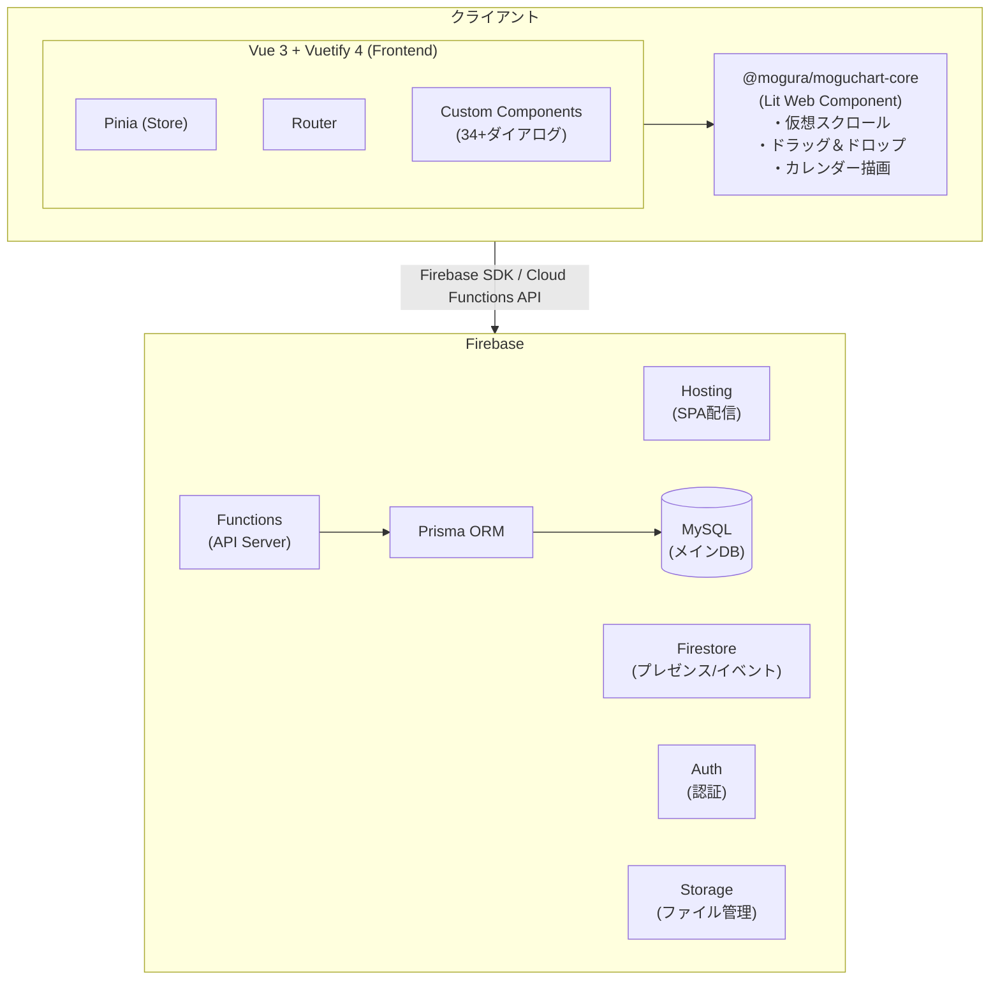

## はじめに

「既存のガントチャートライブラリ、かゆいところに手が届かない…」

プロジェクト管理でガントチャートを使いたいと思ったとき、既存のツールやライブラリに満足できなかった経験はありませんか？ 私もその一人でした。

そこで、**ガントチャートの描画エンジンから自作する** という道を選び、Web アプリケーション **「MoguChart」** を開発しました。

本記事では、MoguChart の全体アーキテクチャと、個人開発で得た知見をまとめます。

:::note info
アプリケーションとしての機能詳細やUXへのこだわりについては、別記事「[無料で使えるWebガントチャート「MoguChart」を作った ─ 個人開発で追求した"ちょうどいい"プロジェクト管理UX](https://qiita.com/hiro-murakami/private/bfdaf141de040cb387b9)」をご覧ください。

また、ガントチャート描画ライブラリ「moguchart-core」の機能や導入方法については、別記事「[フレームワークに縛られないガントチャートを作った — Web Components製「moguchart-core」の紹介](https://qiita.com/hiro-murakami/private/0e4859951a9f652c26c3)」で紹介しています。
:::

## MoguChart とは

MoguChart は、**Web ブラウザ上で動作するガントチャート管理アプリケーション**です。

### 主な特徴

| 機能 | 説明 |
|---|---|
| 🖱️ ドラッグ＆ドロップ | タスクの移動・リサイズ・行間移動・複数選択一括操作 |
| 📅 3つの表示モード | 時間単位 / 日単位 / 月単位 |
| 🔗 依存関係の可視化 | タスク間の依存関係を矢印付き曲線（S字カーブ）で表示 |
| 🎨 高度なカスタマイズ | カラーパレット、パターン、枠線、バー影 |
| 🏁 マイルストーン＆マーカー | プロジェクトの節目を可視化 |
| 👥 リアルタイム共同編集 | 複数ユーザーでの同時編集（プレゼンス表示） |
| 📤 エクスポート | PDF / CSV / Excel |
| 📸 スナップショット | プロジェクト状態の保存・復元 |
| 🌓 テーマ切り替え | ライト / ダーク / システム連動 |
| 🔒 権限管理 | オーナー / 編集者 / 閲覧者 |

## アーキテクチャ全体図



## 技術スタック

### フロントエンド

| 技術 | 用途 |
|---|---|
| **Vue 3** (Composition API) | メイン UI フレームワーク |
| **Vuetify 4** | Material Design コンポーネントライブラリ |
| **Pinia** | 状態管理 |
| **Vue Router** | SPA ルーティング |
| **TypeScript** | 型安全性 |
| **Vite** | ビルドツール |

### コアライブラリ（自作）

| 技術 | 用途 |
|---|---|
| **Lit** | Web Components 基盤 |
| **dayjs** | 日付操作 |
| **html2canvas-pro** + **jspdf** | PDF エクスポート |
| **@holiday-jp/holiday_jp** | 日本の祝日判定 |

### バックエンド

| 技術 | 用途 |
|---|---|
| **Firebase Cloud Functions** | API サーバー |
| **Prisma ORM** (MariaDB adapter) | データベースアクセス |
| **MySQL** | メインデータベース |
| **Firebase Auth** | 認証（Google / ゲスト） |
| **Firestore** | リアルタイムプレゼンス・編集イベント |
| **Firebase Storage** | ファイルストレージ |

### インフラ

| 技術 | 用途 |
|---|---|
| **Firebase Hosting** | SPA 配信・CDN |
| **pnpm workspace** | モノレポ管理 |
| **Google Cloud Secret Manager** | 環境変数管理 |

## なぜ Web Components でガントチャートを自作したのか

### 既存ライブラリの課題

ガントチャートの OSS ライブラリはいくつかありますが、以下の点で不満がありました：

1. **特定フレームワークに依存** — React 用、Vue 用とそれぞれ別のライブラリが必要
2. **カスタマイズ性の限界** — タスクバーの描画やインタラクションを自由に変えられない
3. **パフォーマンス** — 大量タスクでのスクロールが重い
4. **メンテナンス状況** — 更新が止まっているものが多い

### Web Components を選んだ理由

**フレームワーク非依存**であることが最大の動機です。

```html
<!-- どのフレームワークでも同じタグで使える -->
<gantt-chart
  .rows="${rows}"
  .option="${option}"
  @task-update="${handleTaskUpdate}"
></gantt-chart>
```

Lit を選択したのは、Web Components の標準仕様に沿いつつ、リアクティブなプロパティ管理やテンプレートリテラルの恩恵を受けられるためです。

### コアライブラリ `@mogura/moguchart-core` の設計

描画エンジンは別リポジトリ（`moguchart-core`）として切り出し、npm パッケージとして公開しています。

```bash
npm install @mogura/moguchart-core
```

アプリ側からは `link:` で参照し、開発中は変更を即座に反映できるようにしています：

```json
{
  "dependencies": {
    "@mogura/moguchart-core": "link:../../../moguchart-core"
  }
}
```

#### コアの主な実装内容

- **仮想スクロール**: 画面に見える範囲だけを描画し、大量の行・タスクでも60FPSを維持
- **カレンダー描画**: 日/週/月/時間単位の切り替え、祝日表示、現在時刻ライン
- **ドラッグ＆ドロップ**: タスクの移動・リサイズ・行間移動・複数選択
- **依存関係線**: S字カーブでの矢印描画、右→左方向の自動折り返し
- **テーマシステム**: ライト/ダーク/カスタムテーマの CSS Custom Properties ベース

## モノレポ構成

アプリ側は pnpm workspace を使ったモノレポ構成にしています。

```
moguchart-app/
├── packages/
│   ├── frontend/          # Vue 3 + Vuetify 4 フロントエンド
│   │   ├── src/
│   │   │   ├── components/  # 34+ の Vue コンポーネント
│   │   │   ├── composables/ # Vue Composable 関数
│   │   │   ├── modules/     # ユーティリティ・カスタムレンダリング
│   │   │   ├── stores/      # Pinia ストア
│   │   │   ├── views/       # ガントチャートビュー
│   │   │   └── firebase.ts  # Firebase 初期化
│   │   └── package.json
│   └── functions/         # Firebase Cloud Functions バックエンド
│       ├── src/
│       │   └── index.ts     # API エンドポイント
│       ├── prisma/
│       │   ├── schema.prisma # DB スキーマ定義
│       │   └── seed.ts       # シードデータ
│       └── package.json
├── firebase.json          # Firebase 設定
├── firestore.rules        # Firestore セキュリティルール
├── storage.rules          # Storage セキュリティルール
└── pnpm-workspace.yaml    # モノレポ設定
```

フロントエンドとバックエンドを同一リポジトリで管理することで、**型定義の共有**やデプロイの一元化が容易になります。

## データベース設計

### なぜ Firestore ではなく MySQL を選んだのか

Firebase を使っているのに、メインDBは MySQL (Prisma ORM 経由) という構成を採用しています。

**理由**:
- ガントチャートのデータは**リレーショナルな構造**（プロジェクト → 行 → タスク → コメント）
- 複雑なクエリやトランザクションが必要
- Prisma の型安全なデータアクセスを利用したい

**Firestore はリアルタイム機能に特化**:
- プレゼンス情報（誰がオンラインか）
- 編集イベントのリアルタイム配信

```prisma
// データモデルの概要
model Project {
  id        String     @id @default(uuid())
  name      String
  start     DateTime
  end       DateTime
  attribute Json       @default("{}")  // 柔軟な拡張属性
  authority Json       @default("{}")  // 権限情報
  rows      GanttRow[]
  comments  Comment[]
}

model GanttRow {
  id        Int         @id @default(autoincrement())
  projectId String
  name      String
  order     Int         @default(0)
  tasks     GanttTask[]
  project   Project     @relation(...)
}

model GanttTask {
  id        Int       @id @default(autoincrement())
  rowId     Int
  name      String
  start     DateTime
  end       DateTime
  attribute Json      @default("{}")  // ラベル、色、パターン等
  row       GanttRow  @relation(...)
}
```

**ポイント: `attribute` カラムの活用**

スキーマを頻繁に変更せずに柔軟な属性を追加できるよう、`Json` 型の `attribute` カラムを各テーブルに持たせています。カラーパレット、パターン、枠線スタイル、ラベルなど、UI側で拡張が多い属性をここに格納しています。

## Firebase の使い分け

MoguChart では Firebase の各サービスを**適材適所**で使い分けています。

```
Firebase Auth     → 認証（Google ログイン / ゲストログイン）
Cloud Functions   → API サーバー（Prisma 経由で MySQL にアクセス）
Firestore         → リアルタイム機能のみ（プレゼンス・編集イベント）
Firebase Hosting  → SPA の配信
Firebase Storage  → ファイル管理（バックアップ等）
```

### Firestore セキュリティルール

リアルタイム機能部分のルールは必要最小限に設計しています：

```javascript
rules_version = '2';

service cloud.firestore {
  match /databases/{database}/documents {
    // プレゼンス: 認証済みユーザーは読み取り可、自分のドキュメントのみ書き込み可
    match /projects/{projectId}/presence/{userId} {
      allow read: if request.auth != null;
      allow write: if request.auth != null
        && (request.auth.token.email == userId
            || request.auth.uid == userId);
    }

    // 編集イベント: 認証済みなら作成・読み取り可、更新不可（append-only）
    match /projects/{projectId}/editEvents/{eventId} {
      allow read: if request.auth != null;
      allow create: if request.auth != null;
      allow delete: if request.auth != null;
      allow update: if false;
    }
  }
}
```

## フロントエンドの設計

### コンポーネント設計

34以上のVueコンポーネントを開発しています。主要なものを紹介します：

| カテゴリ | コンポーネント | 説明 |
|---|---|---|
| **メインビュー** | `GanttChartView` | ガントチャート表示・操作の中核 |
| **プロジェクト管理** | `ProjectListDialog` | プロジェクト一覧・検索・アーカイブ |
| | `ProjectDetailDialog` | プロジェクト詳細設定（カラーパレット、ラベル等） |
| | `ProjectDuplicateDialog` | プロジェクト複製（ステッパー形式） |
| **タスク操作** | `TaskFormDialog` | タスク作成・編集フォーム |
| | `TaskDetailDialog` | タスク詳細表示 |
| | `TaskTemplateDialog` | タスクテンプレート管理 |
| **コラボレーション** | `ProjectCommentPanel` | プロジェクトコメントサイドバー |
| | `CollaborationActivityLog` | 共同編集アクティビティログ |
| **表示制御** | `DisplaySettingsMenu` | テーマ・バー高さ・影・読み取り専用 |
| | `ZoomControls` | ズームレベル調整 |

### カスタムレンダリング

`ganttChartCustomRendering.ts` (約35KB) で、ガントチャートのタスクバー・行ヘッダー・ツールチップなどのカスタム描画ロジックを集中管理しています。Web Components の slot やコールバックを活用して、コアライブラリの描画をアプリ固有の表現にカスタマイズしています。

### 状態管理 (Pinia)

```typescript
// ユーザーストア: 認証状態・テーマ設定・バージョン管理
const userStore = useUserStore()

// プロジェクトストア: 現在開いているプロジェクトの状態
const projectStore = useProjectStore()
```

Firebase Auth のリスナーを Pinia ストアで管理し、認証状態の変化をリアクティブに UI に反映しています。

## 開発で工夫した点

### 1. バージョン同期の自動化

モノレポ内のバージョン番号を一元管理するスクリプトを用意しています：

```json
{
  "scripts": {
    "predev": "pnpm run sync-version",
    "prebuild": "pnpm run sync-version"
  }
}
```

`dev` や `build` の前に自動実行されるため、バージョンのずれが発生しません。

### 2. 環境変数の安全な管理

Google Cloud Secret Manager からの自動取得スクリプトを用意し、機密情報をリポジトリに含めない設計にしています：

```json
{
  "scripts": {
    "setup:env": "pnpm -r run setup:env"
  }
}
```

### 3. ゲストログイン

Googleアカウントがなくても気軽に試せるよう、**ゲストログイン機能**を実装しました。ゲストユーザーのデータは約24時間後に自動削除されます。

### 4. リリースノートの自動表示

バージョンアップ後の初回ログイン時にリリースノートダイアログを自動表示し、ユーザーに新機能を伝えています：

```typescript
// バージョンアップ時にリリースノートを自動表示
watch(versionUpdated, (updated) => {
  if (updated) {
    showReleaseNotes.value = true
  }
})
```

## 開発の振り返り

### 個人開発で学んだこと

1. **コアロジックの切り出しは早めに** — Web Components として切り出したことで、コアの変更がアプリに波及しにくくなった
2. **Json カラムの柔軟性** — UI 側の頻繁な属性追加にマイグレーションなしで対応できた
3. **Firebase + MySQL のハイブリッド** — リアルタイム機能とRDBの良いとこ取りができた
4. **モノレポの恩恵** — フロント・バックの型定義共有でバグが激減

## まとめ

MoguChart は、**ガントチャートのコアエンジン（Web Components）** と **フル機能の Web アプリケーション（Vue 3 + Firebase）** の2層構造で設計しています。

コアライブラリ `@mogura/moguchart-core` はフレームワーク非依存なので、Vue だけでなく React や Angular でも利用できます。

個人開発でも、適切なアーキテクチャ設計を最初に行うことで、継続的な機能追加がスムーズに進むことを実感しました。

---


ご質問やフィードバックがありましたら、コメントでお気軽にどうぞ！
