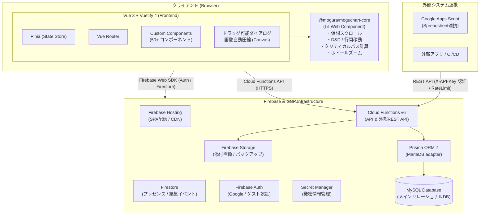

## はじめに

「既存のガントチャートライブラリ、かゆいところに手が届かない…」

プロジェクト管理でガントチャートを使いたいと思ったとき、既存のツールやライブラリに満足できなかった経験はありませんか？ 私もその一人でした。

そこで、**ガントチャートの描画エンジンから自作する** という道を選び、Web アプリケーション **「MoguChart」** を開発しました。

本記事では、MoguChart の全体アーキテクチャと、個人開発で得た知見・技術的な工夫を余すところなくまとめます。

:::note info
アプリケーションとしての機能詳細やUXへのこだわりについては、別記事「[無料で使えるWebガントチャート「MoguChart」を作った ─ 個人開発で追求した"ちょうどいい"プロジェクト管理UX](https://qiita.com/hiroyuki_m/items/bfdaf141de040cb387b9)」をご覧ください。

また、ガントチャート描画ライブラリ「moguchart-core」の機能や導入方法については、別記事「[フレームワークに縛られないガントチャートを作った — Web Components製「moguchart-core」の紹介](https://qiita.com/hiroyuki_m/items/0e4859951a9f652c26c3)」で紹介しています。

アプリケーションのソースコードは GitHub リポジトリ [hiro-murakami/moguchart-app](https://github.com/hiro-murakami/moguchart-app) で公開しています。
:::

## MoguChart とは

MoguChart は、**Web ブラウザ上で動作する高機能ガントチャート管理アプリケーション**です。

### 主な特徴

| 機能 | 説明 |
|---|---|
| 🖱️ **ドラッグ＆ドロップ** | タスクの移動・リサイズ・行間移動・複数選択一括操作 |
| 📅 **4つの表示モード** | 時間単位 / 日単位 / 週単位 / 月単位（等幅表示・最長100年対応） |
| 🔗 **依存関係＆クリティカルパス** | 矢印付き曲線（S字）/直角線での可視化、最長遅延チェーンの自動ハイライト |
| 🔍 **直感的なズーム** | Ctrl/Cmd + マウスホイールでの拡大縮小、自動フィット |
| 🖼️ **画像添付＆クリップボード連携** | タスク・行への画像添付、クリップボード貼り付け（Ctrl+V）、D&Dアップロード、自動圧縮、ライトボックス表示 |
| 🏁 **マイルストーン＆マーカー** | 縦線マイルストーン ＋ 行ごとの個別日時マーカー（マルチレーン自動配置） |
| 👥 **リアルタイム共同編集** | 複数ユーザーでの同時編集、プレゼンス・アクティビティログ表示 |
| 🔑 **外部連携 REST API** | APIキー認証、レートリミット付きREST API、GASテンプレート、OpenAPI仕様 |
| 🌐 **公開閲覧モード** | 一般公開フラグによる未ログインユーザーの安全な閲覧共有 |
| 💬 **多層コメント機能** | プロジェクト / 行 / タスクごとのスレッドコメント |
| 📤 **エクスポート** | PDF（複数ページ分割対応） / PNG / CSV / Excel |
| 📸 **スナップショット** | プロジェクト状態の保存・復元・バックアップJSON入出力 |
| 🌓 **テーマ切り替え** | ライト / ダーク / システム連動 ＋ 30項目以上のカラーカスタマイズ |
| 🔒 **きめ細かな権限管理** | オーナー / 編集者 / 閲覧者ロールによるアクセス制御 |

## アーキテクチャ全体図


```mermaid
flowchart TB
    subgraph Client ["クライアント (Browser)"]
        subgraph Frontend ["Vue 3 + Vuetify 4 (Frontend)"]
            Pinia["Pinia (State Store)"]
            Router["Vue Router"]
            Custom["Custom Components<br>(50+ コンポーネント)"]
            Draggable["ドラッグ可能ダイアログ<br>画像自動圧縮 (Canvas)"]
        end

        Core["@mogura/moguchart-core<br>(Lit Web Component)<br>・仮想スクロール<br>・D&D / 行間移動<br>・クリティカルパス計算<br>・ホイールズーム"]

        Frontend --> Core
    end

    subgraph External ["外部システム連携"]
        GAS["Google Apps Script<br>(Spreadsheet連携)"]
        ThirdParty["外部アプリ / CI/CD"]
    end

    subgraph Firebase ["Firebase & GCP Infrastructure"]
        Hosting["Firebase Hosting<br>(SPA配信 / CDN)"]
        Functions["Cloud Functions v6<br>(API & 外部REST API)"]
        Firestore["Firestore<br>(プレゼンス / 編集イベント)"]
        Auth["Firebase Auth<br>(Google / ゲスト認証)"]
        Storage["Firebase Storage<br>(添付画像 / バックアップ)"]
        SecretMgr["Secret Manager<br>(機密情報管理)"]
        Prisma["Prisma ORM 7<br>(MariaDB adapter)"]
        MySQL[("MySQL Database<br>(メインリレーショナルDB)")]

        Functions --> Prisma
        Prisma --> MySQL
        Functions --> Storage
    end

    Client -->|"Firebase Web SDK (Auth / Firestore)"| Firebase
    Client -->|"Cloud Functions API (HTTPS)"| Functions
    External -->|"REST API (X-API-Key 認証 / RateLimit)"| Functions
```

## 技術スタック

### フロントエンド

| 技術 | バージョン | 用途 |
|---|---|---|
| **Vue 3** | ^3.5 | メイン UI フレームワーク（Composition API, `<script setup>`） |
| **Vuetify 4** | ^4.0 | Material Design コンポーネントライブラリ |
| **Pinia** | ^3.0 | アプリケーション状態管理（ユーザー、プロジェクト） |
| **Vue Router** | ^4.6 | クライアントサイドルーティング（公開閲覧対応） |
| **TypeScript** | ^5.9 | 型安全性 |
| **Vite** | ^8.0 | 高速ビルド＆開発環境 |

### コア描画エンジン（自作 Web Component）

| 技術 | バージョン | 用途 |
|---|---|---|
| **@mogura/moguchart-core** | ^0.9.0 | Lit ベースのガントチャート描画エンジン |
| **Lit** | ^3.3 | Web Components 基盤 |
| **html2canvas-pro** + **jspdf** | - | 高解像度 PNG / 分割 PDF エクスポート |
| **@holiday-jp/holiday_jp** | - | 日本の祝日自動判定 |

### バックエンド ＆ データベース

| 技術 | バージョン | 用途 |
|---|---|---|
| **Firebase Cloud Functions** | ^6.3 | サーバーレス API（Node.js 24） |
| **Express** | ^5.2 | REST API ルーティング ＆ レートリミット処理 |
| **Prisma ORM** | ^7.4 | 型安全なデータベース ORM（MariaDB adapter） |
| **MySQL** | - | メインリレーショナルデータベース |
| **Firebase Auth** | - | Google 認証 ＆ ゲストログイン（匿名認証＋TTL） |
| **Firestore** | - | リアルタイムプレゼンス・編集イベント配信 |
| **Firebase Storage** | - | タスク・行の添付画像、バックアップデータ保管 |

### インフラ ＆ 開発運用

| 技術 | 用途 |
|---|---|
| **Firebase Hosting** | SPA 静的配信 ＆ CDN キャッシュ |
| **Google Cloud Secret Manager** | 環境変数・接続文字列のセキュア管理 |
| **pnpm workspace (pnpm 11)** | フロント・バックエンドの一元モノレポ管理 |
| **Terraform** | GCP / Firebase インフラのコード化 (IaC) |
| **OpenAPI 3.1** | 外部 REST API の仕様定義 |

## なぜ Web Components でガントチャートを自作したのか

### 既存ライブラリの課題

ガントチャートのライブラリは世の中に存在しますが、以下の点で導入に踏み切れませんでした：

1. **特定フレームワークへの依存** — React 用や Vue 用で別れており、移行や将来の技術選定に制約がかかる
2. **カスタマイズ性の限界** — タスクバー内の複雑な表現（画像サムネイル、複数行ラベル、影、パターン等）を自由にいじれない
3. **パフォーマンス** — 数百タスクを超えると DOM 要素が膨大になり、スクロールがカクつく
4. **ライセンスとコスト** — 実用的な商用ライブラリは年間数十万円と個人・小規模チームには高価

### Web Components を選んだ理由

**「Custom Elements」というブラウザ標準仕様に準拠することで、フレームワーク非依存で普遍的に利用できること**が最大の動機です。

```html
<!-- Vue でも React でも バニラ HTML でも同じタグで動く -->
<gantt-chart
  .rows="${rows}"
  .option="${option}"
  @task-update="${handleTaskUpdate}"
></gantt-chart>
```

Lit を選択したことで、軽量（オーバーヘッド最小限）かつリアクティブなプロパティ管理、SVG レンダリングの柔軟性を両立できました。

### コアライブラリ `@mogura/moguchart-core` の設計

描画エンジンは独立リポジトリ（`moguchart-core`）として切り出し、npm パッケージとして公開しています。

```bash
npm install @mogura/moguchart-core
```

アプリ側からはモノレポ内でローカル参照（`link:`）し、コアエンジンの修正がアプリ側に即時反映される開発体験を構築しています：

```json
{
  "dependencies": {
    "@mogura/moguchart-core": "link:../../../moguchart-core"
  }
}
```

#### コアエンジンの主な責務
- **仮想スクロール**: 表示領域のみを動的に DOM 描画し、大量データでも 60FPS を維持
- **カレンダー描画**: 時間/日/週/月（最長100年）の等幅カレンダー、祝日ハイライト、現在時刻インジケーター
- **インタラクション**: タスクの移動・期間リサイズ・行間移動・複数選択一括ドラッグ
- **依存関係＆クリティカルパス**: S字ベジェ曲線 / 直角折れ線、最長遅延チェーンの自動算出
- **ズーム機能**: マウスホイールによる滑らかな拡大縮小
- **テーマ機構**: CSS Custom Properties ベースのカラーシステム

## モノレポ構成

アプリ全体は pnpm workspace を使ったモノレポ構成で管理しています。

```
moguchart-app/
├── packages/
│   ├── frontend/                # Vue 3 + Vuetify 4 フロントエンド
│   │   ├── src/
│   │   │   ├── components/      # 50+ の Vue コンポーネント・ダイアログ
│   │   │   ├── composables/     # 状態・操作用 Composable 関数
│   │   │   ├── directives/      # ドラッグ移動等のカスタムディレクティブ
│   │   │   ├── modules/         # カスタムレンダリング・画像圧縮・エクスポート
│   │   │   ├── stores/          # Pinia ストア（user, project）
│   │   │   ├── views/           # ガントチャートビュー（公開閲覧対応）
│   │   │   └── firebase.ts      # Firebase 初期化
│   │   └── package.json
│   └── functions/               # Firebase Cloud Functions バックエンド
│       ├── src/
│       │   ├── api/             # 外部向け REST API (Express)
│       │   ├── generated/prisma # Prisma Client
│       │   └── index.ts         # Cloud Functions エントリポイント
│       ├── prisma/
│       │   ├── schema.prisma    # MySQL スキーマ定義
│       │   ├── migrations/      # マイグレーション履歴
│       │   └── seed.ts          # シードデータ
│       └── package.json
├── docs/
│   ├── openapi.yaml             # REST API OpenAPI 3.1 仕様書
│   ├── gas-template/            # Google Apps Script 連携スクリプト
│   └── samples/                 # サンプルプロジェクト JSON
├── terraform/                   # GCP/Firebase インフラ定義
├── firebase.json                # Firebase 設定
├── firestore.rules              # Firestore セキュリティルール
├── storage.rules                # Storage セキュリティルール
└── pnpm-workspace.yaml          # モノレポ設定
```

フロントエンドとバックエンドが同一リポジトリにあるため、**Prisma から生成される型定義や DTO の共有**が容易になり、型不一致による不具合を排除できます。

## データベース設計

### なぜ Firestore ではなく MySQL を選んだのか

Firebase を利用しながらも、メインデータベースには MySQL（Prisma ORM 経由）を採用しています。

**理由**:
1. ガントチャートは**階層的でリレーショナルな構造**（プロジェクト → 行 → タスク → 依存関係・コメント・画像）を持つため、RDB の方が整合性を保ちやすい
2. 行の並び順変更やタスクの一括更新、プロジェクトの複製などを**単一のトランザクション**でアトミックに処理したい
3. Prisma の型安全なクエリビルダーにより、保守性とリファクタリング耐性を最大化できる

**Firestore はリアルタイム機能に特化**:
- リアルタイムプレゼンス（オンライン状態・カーソル位置）
- 他ユーザーの編集通知イベント配信

```prisma
// schema.prisma の抜粋

model Project {
  id        String     @id @default(uuid()) @db.Char(36)
  name      String
  start     DateTime   @db.DateTime(3)
  end       DateTime   @db.DateTime(3)
  attribute Json       @default("{}")  // カラーパレット、ラベル定義、表示設定
  public    Boolean    @default(false) // 一般公開フラグ
  authority Json       @default("{}")  // メンバー権限（owner, editor, viewer）
  rows      GanttRow[]
  comments  Comment[]
}

model GanttRow {
  id        Int         @id @default(autoincrement())
  projectId String      @db.Char(36)
  name      String
  order     Int         @default(0)
  visible   Boolean     @default(true)
  attribute Json        @default("{}")  // 行ラベル、添付画像メタデータ等
  project   Project     @relation(fields: [projectId], references: [id], onDelete: Cascade)
  tasks     GanttTask[]
  comments  Comment[]
}

model GanttTask {
  id        Int       @id @default(autoincrement())
  rowId     Int
  name      String
  start     DateTime
  end       DateTime
  attribute Json      @default("{}")  // 色、パターン、進捗率、依存先、添付画像等
  row       GanttRow  @relation(fields: [rowId], references: [id], onDelete: Cascade)
  comments  Comment[]
}

model Comment {
  id        Int        @id @default(autoincrement())
  taskId    Int?
  rowId     Int?
  projectId String?    @db.Char(36)
  content   String     @db.Text
  createdBy String?    @default("system")
  createdAt DateTime?  @default(now()) @db.Timestamp(3)
  task      GanttTask? @relation(fields: [taskId], references: [id], onDelete: Cascade)
  row       GanttRow?  @relation(fields: [rowId], references: [id], onDelete: Cascade)
  project   Project?   @relation(fields: [projectId], references: [id], onDelete: Cascade)
}

model ApiKey {
  id         String    @id @default(uuid()) @db.Char(36)
  key        String    @unique @db.VarChar(64)
  name       String    @db.VarChar(255)
  email      String
  scope      String    @default("read-write") @db.VarChar(20)
  active     Boolean   @default(true)
  lastUsedAt DateTime? @db.Timestamp(3)
  createdAt  DateTime  @default(now()) @db.Timestamp(3)
}
```

### 💡 設計のポイント: `Json` 属性カラムの活用

UI の機能拡張（バーの影、枠線、グラデーション、進捗率、ラベル、マーカー、添付画像リストなど）を素早く追加できるよう、各テーブルに `attribute Json` カラムを持たせています。

これにより、**DB マイグレーションを都度走らせることなくフロントエンド主導で新しいプロパティを追加**でき、爆速な機能追加と安定性を両立しています。

## 外部連携 REST API ＆ セキュリティ

MoguChart は単なる画面操作にとどまらず、スプレッドシートや外部システムと連携できる **REST API** を提供しています。

```
Client / GAS / CI  ──( X-API-Key: mk_... )──>  Express REST API (Cloud Functions)
                                                        │
                                          ┌─────────────┴─────────────┐
                                          ▼                           ▼
                                    Rate Limiter                Prisma / MySQL
                               (60 req/min, Sliding Window)
```

1. **APIキー認証 (`X-API-Key`)**:
   - `read` / `read-write` のスコープ制御
   - WebUI 上でのキー発行・一覧確認・無効化
2. **レートリミット保護**:
   - 1分あたり 60 リクエストのスライディングウィンドウカウンター
   - 超過時は `429 Too Many Requests` と `Retry-After` を返却
3. **Google Apps Script (GAS) 連携**:
   - スプレッドシートのカスタムメニューからワンクリックでガントチャートのプロジェクト・タスク一覧を同期取得
4. **OpenAPI 3.1 仕様書**:
   - `docs/openapi.yaml` を同梱し、クライアントコードの自動生成やドキュメント参照が可能

## フロントエンド実装のこだわり

### 1. 50以上のコンポーネントによる丁寧なUI設計

画面をブロック単位・ダイアログ単位でモジュール化し、複雑化を防いでいます。

- **メイン画面**: `GanttChartView.vue`（Web Component を内包しイベントを中継）
- **画像管理**: `ImageManageDialog.vue`（D&Dアップロード、クリップボード貼り付け、サムネイル、ライトボックス）
- **マーカー管理**: `MarkerFormDialog.vue`、`MarkerContextMenu.vue`
- **外部連携**: `ApiKeyManageDialog.vue`
- **操作系**: `TaskFormDialog.vue`、`SlideScheduleDialog.vue`、`SnapshotListDialog.vue`

### 2. ダイアログのドラッグ移動（`v-draggable-dialog`）

タスク編集やコメント投稿を行う際、**ダイアログが背後のガントチャートを隠してしまわないよう、タイトルバーを掴んで自由に移動できるカスタムディレクティブ**を実装しています。

### 3. クリップボード貼り付け ＆ 自動画像圧縮

画像を添付する際、スクリーンショットをコピーしてダイアログ上で `Ctrl+V`（`⌘+V`）を押すだけで貼り付け・アップロードが完了します。
また、5MB を超える画像は **ブラウザ側で HTML Canvas を用いて最大 1920px・最適 JPEG 品質に自動リサイズ・圧縮** してから Firebase Storage に送信するため、通信量とストレージ容量を最小限に抑えています。

### 4. 集中管理されたカスタムレンダリング

`ganttChartCustomRendering.ts` にて、タスクバー内部の描画（進捗バー、ラベル、画像バッジ、影）、行ヘッダーのツールチップ、祝日背景などを一括定義し、Web Component 側に注入しています。

## 開発を支える運用・自動化の仕組み

### 1. バージョン同期の自動化 (`scripts/sync-version.mjs`)

ルートの `package.json` のバージョン（例: `0.9.0`）を、フロント・バックエンド・ドキュメントへビルド前に自動同期します。

```json
{
  "scripts": {
    "predev": "pnpm run sync-version",
    "prebuild": "pnpm run sync-version"
  }
}
```

### 2. Secret Manager による安全な環境変数注入

ローカル開発や CI 環境で機密情報を `.env` に直書きしてコミットするリスクを防ぐため、Google Cloud Secret Manager から自動フェッチするスクリプトを用意しています。

### 3. ゲストログインと自動クリーンアップ

ユーザー登録なしですぐに全機能を試せる「ゲストログイン」を提供。ゲストユーザーのデータやプレゼンス情報は、Cloud Functions の定期実行タスク（スケジュール関数）によって自動クリーンアップされます。

### 4. Terraform によるインフラ管理

Firebase プロジェクト、GCP サービスアカウント、Secret Manager、Storage バケットなどのインフラ設定を `terraform/` 配下でコード管理（IaC）しています。

## 開発の振り返りと学び

1. **コア描画エンジンとアプリの分離が最大の成功要因**
   ガントチャートの描画・D&D・仮想スクロールなどの低レイヤーを Web Component（Lit）として疎結合にしたことで、アプリ側の Vue 3 / Vuetify のバージョンアップやリファクタリングが極めて安全に行えました。
2. **リレーショナル DB (Prisma) ＋ JSON カラムの相性の良さ**
   整合性が必要なリレーション（Project - Row - Task - Comment）は RDB で堅牢に守りつつ、UI 固有の多彩な属性は JSON カラムで柔軟に扱うハイブリッド設計が、個人開発のスピード感を劇的に高めました。
3. **REST API と GAS 連携による実用性の向上**
   WebUI だけでなく REST API とスプレッドシート連携を提供したことで、「既存の業務データを取り込む」「他ツールと連携する」といった実用性が一気に広がりました。

## まとめ

MoguChart は、**「Web Components 製の軽量描画エンジン」** と **「Vue 3 ＋ Firebase ＋ MySQL による堅牢なフルスタック Web アプリ」** という2層構造で成り立っています。

個人開発であっても、最初から適切な境界（コア分離・モノレポ・型共有・IaC）を敷いておくことで、機能追加を重ねても破綻せず、楽しく開発を継続できています。

---

GitHub リポジトリでもコードを公開していますので、ぜひチェックしてみてください 🙌

- [moguchart-core (ガントチャート描画エンジン)](https://github.com/hiro-murakami/moguchart-core)
- [moguchart-app (Web アプリケーション)](https://github.com/hiro-murakami/moguchart-app)
- [オンラインデモ / アプリケーション](https://moguchart.web.app)
