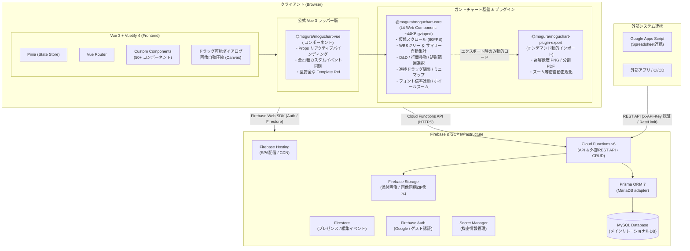

## はじめに

「既存のガントチャートライブラリ、かゆいところに手が届かない…」

プロジェクト管理でガントチャートを使いたいと思ったとき、既存のツールやライブラリに満足できなかった経験はありませんか？ 私もその一人でした。

そこで、**ガントチャートの描画エンジンから自作する** という道を選び、Web アプリケーション **「MoguChart」** を開発しました。

本記事では、MoguChart の全体アーキテクチャと、個人開発で得た知見・技術的な工夫を余すところなくまとめます。

:::note info
アプリケーションとしての機能詳細やUXへのこだわりについては、別記事「[無料で使えるWebガントチャート「MoguChart」を作った ─ 個人開発で追求した"ちょうどいい"プロジェクト管理UX](https://qiita.com/hiroyuki_m/items/bfdaf141de040cb387b9)」をご覧ください。

また、ガントチャート描画ライブラリ「moguchart-core」の機能や導入方法については、別記事「[フレームワークに縛られないガントチャートを作った — Web Components製「moguchart-core」の紹介](https://qiita.com/hiroyuki_m/items/0e4859951a9f652c26c3)」で紹介しています。

アプリケーションのソースコードは GitHub リポジトリ [hiro-murakami/moguchart-app](https://github.com/hiro-murakami/moguchart-app) で公開しています。
:::

## MoguChart とは

MoguChart は、**Web ブラウザ上で動作する高機能ガントチャート管理アプリケーション**です。

### 主な特徴

| 機能 | 説明 |
|---|---|
| 🌳 **WBS（階層ツリー構造・行開閉）** | `parentId` による無制限の親子階層、インデント表示、開閉トグル（▶/▼）、安全なブロック連動D&D並び替え |
| 📊 **サマリータスク（自動計算＆描画）** | 配下全子タスクの最小開始日〜最大終了日、期間加重平均進捗率を自動集計して山型ブラケットバーを描画。通常タスクとの2段共存描画対応 |
| 🔍 **表示倍率（ズーム）＆ フォント連動** | 全体（文字・ヘッダー・バー高さ）が自然に伸縮するズームシステム（50%〜200%）、Chrome風UI、カレンダー横幅の独立設定 |
| 🖱️ **ドラッグ＆ドロップ** | タスクの移動・リサイズ・行間移動・複数選択一括操作 |
| 🔲 **矩形範囲選択（ラバーバンド選択）** | 空白背景ドラッグによる複数タスク一括選択、AABB交差判定、累積追加選択、オートスクロール |
| 📈 **進捗管理 ＆ 直感的ドラッグ編集** | バー端ハンドルによる直感的ドラッグ変更（スナップ・Escキャンセル対応）、プロジェクト単位の進捗表示設定 |
| 🗺️ **ミニマップ（鳥瞰ビュー）** | 全体プレビュー、ビューポートパン操作、ドラッグ移動、リサイズ、透過率調整、タスク進捗率の濃淡自動反映 |
| 📅 **4つの表示モード** | 時間単位 / 日単位 / 週単位 / 月単位（等幅表示・最長100年対応） |
| 🔗 **依存関係＆クリティカルパス** | 矢印付き曲線（S字）/直角線での可視化、最長遅延チェーンの自動ハイライト |
| 🖼️ **画像添付＆クリップボード連携** | タスク・行への画像添付、クリップボード貼り付け（Ctrl+V）、D&Dアップロード、自動圧縮、ホバーディレイ付きプレビュー |
| 🏁 **マイルストーン＆マーカー** | 縦線マイルストーン ＋ 行ごとの個別日時マーカー（マルチレーン自動配置） |
| 👤 **担当者設定 ＆ 権限分離** | 担当者メールアドレス補完、閲覧者ロールでも自身の担当タスク進捗率のみ更新可能な実務的権限設計 |
| 👥 **リアルタイム共同編集** | 複数ユーザーでの同時編集、プレゼンス・アクティビティログ表示（最小化対応） |
| 🔑 **外部連携 REST API** | APIキー認証、レートリミット、プロジェクト・行・タスク・コメントのCRUD、GAS連携、OpenAPI仕様 |
| 🌐 **公開閲覧モード** | 一般公開フラグによる未ログインユーザーの安全な閲覧共有 |
| 💬 **多層コメント機能** | プロジェクト / 行 / タスクごとのスレッドコメント |
| 📤 **多彩なエクスポート** | PDF（複数ページ分割） / PNG / CSV / Excel / **ZIP（添付画像完全同梱・自動復元）**、オンデマンド動的インポート＆ズーム自動正規化対応 |
| 📸 **スナップショット** | プロジェクト状態の保存・復元・バックアップJSON入出力 |
| 🌓 **テーマ切り替え** | ライト / ダーク / システム連動 ＋ 30項目以上のカラーカスタマイズ、モダンなテーマカードUI |
| 🔒 **きめ細かな権限管理** | オーナー / 編集者 / 閲覧者ロールによるアクセス制御 |

## アーキテクチャ全体図


```mermaid
flowchart TB
    subgraph Client ["クライアント (Browser)"]
        subgraph Frontend ["Vue 3 + Vuetify 4 (Frontend)"]
            Pinia["Pinia (State Store)"]
            Router["Vue Router"]
            Custom["Custom Components<br>(50+ コンポーネント)"]
            Draggable["ドラッグ可能ダイアログ<br>画像自動圧縮 (Canvas)"]
        end

        subgraph Wrapper ["公式 Vue 3 ラッパー層"]
            VueWrapper["@mogura/moguchart-vue<br>(<GanttChart> コンポーネント)<br>・Props リアクティブバインディング<br>・全21種カスタムイベント同期<br>・型安全な Template Ref"]
        end

        subgraph CoreEngine ["ガントチャート基盤 & プラグイン"]
            Core["@mogura/moguchart-core<br>(Lit Web Component: ~44KB gzipped)<br>・仮想スクロール (60FPS)<br>・WBSツリー ＆ サマリー自動集計<br>・D&D / 行間移動 / 矩形範囲選択<br>・進捗ドラッグ編集 / ミニマップ<br>・フォント倍率連動 / ホイールズーム"]
            ExportPlugin["@mogura/moguchart-plugin-export<br>(オンデマンド動的インポート)<br>・高解像度 PNG / 分割 PDF<br>・ズーム等倍自動正規化"]
        end

        Frontend --> Wrapper
        Wrapper --> Core
        Core -.->|"エクスポート時のみ動的ロード"| ExportPlugin
    end

    subgraph External ["外部システム連携"]
        GAS["Google Apps Script<br>(Spreadsheet連携)"]
        ThirdParty["外部アプリ / CI/CD"]
    end

    subgraph Firebase ["Firebase & GCP Infrastructure"]
        Hosting["Firebase Hosting<br>(SPA配信 / CDN)"]
        Functions["Cloud Functions v6<br>(API & 外部REST API・CRUD)"]
        Firestore["Firestore<br>(プレゼンス / 編集イベント)"]
        Auth["Firebase Auth<br>(Google / ゲスト認証)"]
        Storage["Firebase Storage<br>(添付画像 / 画像同梱ZIP復元)"]
        SecretMgr["Secret Manager<br>(機密情報管理)"]
        Prisma["Prisma ORM 7<br>(MariaDB adapter)"]
        MySQL[("MySQL Database<br>(メインリレーショナルDB)")]

        Functions --> Prisma
        Prisma --> MySQL
        Functions --> Storage
    end

    Client -->|"Firebase Web SDK (Auth / Firestore)"| Firebase
    Client -->|"Cloud Functions API (HTTPS)"| Functions
    External -->|"REST API (X-API-Key 認証 / RateLimit)"| Functions
```

## 技術スタック

### フロントエンド

| 技術 | バージョン | 用途 |
|---|---|---|
| **Vue 3** | ^3.5 | メイン UI フレームワーク（Composition API, `<script setup>`） |
| **Vuetify 4** | ^4.0 | Material Design コンポーネントライブラリ |
| **Pinia** | ^3.0 | アプリケーション状態管理（ユーザー、プロジェクト） |
| **Vue Router** | ^4.6 | クライアントサイドルーティング（公開閲覧対応） |
| **TypeScript** | ^5.9 | 型安全性 |
| **Vite** | ^8.0 | 高速ビルド＆開発環境 |

### コア描画エンジン ＆ ガントチャート基盤

| 技術 | バージョン | 用途 |
|---|---|---|
| **@mogura/moguchart-core** | ^1.1.0 | Lit ベースのコアガントチャート描画エンジン（超軽量 ~44KB gzipped） |
| **@mogura/moguchart-vue** | ^1.1.0 | **公式 Vue 3 ラッパー**（リアクティブ Props、Vue 標準 emits、型安全 Ref） |
| **@mogura/moguchart-plugin-export** | ^1.1.0 | **公式エクスポートプラグイン**（PNG/PDF 高画質出力、オンデマンド動的インポート） |
| **Lit** | ^3.3 | Web Components 基盤 |
| **内製祝日判定モジュール** | - | 日本の祝日自動判定・カスタムロジック注入対応 |

### バックエンド ＆ データベース

| 技術 | バージョン | 用途 |
|---|---|---|
| **Firebase Cloud Functions** | ^6.3 | サーバーレス API（Node.js 24） |
| **Express** | ^5.2 | REST API ルーティング ＆ レートリミット処理 |
| **Prisma ORM** | ^7.4 | 型安全なデータベース ORM（MariaDB adapter） |
| **MySQL** | - | メインリレーショナルデータベース |
| **Firebase Auth** | - | Google 認証 ＆ ゲストログイン（匿名認証＋TTL） |
| **Firestore** | - | リアルタイムプレゼンス・編集イベント配信 |
| **Firebase Storage** | - | タスク・行の添付画像、バックアップデータ保管 |

### インフラ ＆ 開発運用

| 技術 | 用途 |
|---|---|
| **Firebase Hosting** | SPA 静的配信 ＆ CDN キャッシュ |
| **Google Cloud Secret Manager** | 環境変数・接続文字列のセキュア管理 |
| **pnpm workspace (pnpm 11)** | フロント・バックエンドの一元モノレポ管理 |
| **Terraform** | GCP / Firebase インフラのコード化 (IaC) |
| **OpenAPI 3.1** | 外部 REST API の仕様定義 |

## なぜ Web Components でガントチャートを自作したのか

### 既存ライブラリの課題

ガントチャートのライブラリは世の中に存在しますが、以下の点で導入に踏み切れませんでした：

1. **特定フレームワークへの依存** — React 用や Vue 用で別れており、移行や将来の技術選定に制約がかかる
2. **カスタマイズ性の限界** — タスクバー内の複雑な表現（画像サムネイル、複数行ラベル、影、パターン等）を自由にいじれない
3. **パフォーマンス** — 数百タスクを超えると DOM 要素が膨大になり、スクロールがカクつく
4. **ライセンスとコスト** — 実用的な商用ライブラリは年間数十万円と個人・小規模チームには高価

### Web Components を選んだ理由と公式 Vue 3 ラッパーへの進化

**「Custom Elements」というブラウザ標準仕様に準拠することで、フレームワーク非依存で普遍的に利用できること**が最大の動機です。

Lit を選択したことで、軽量（オーバーヘッド最小限）かつリアクティブなプロパティ管理、SVG レンダリングの柔軟性を両立できました。

さらに、アプリケーション開発をさらに加速させるため、v1.1.0 ではコア Web Component を Vue 3 ネイティブに扱える **公式 Vue 3 ラッパー `@mogura/moguchart-vue`** を開発・全面導入しました。

```vue
<!-- 生の Web Component ではなく、公式 Vue 3 コンポーネントとして完全型安全に記述 -->
<GanttChart
  ref="ganttChartRef"
  :rows="displayRows"
  :option="chartOption"
  :selected-row-ids="selectedRowIds"
  :style="{ '--moguchart-font-scale': fontScale }"
  @task-update="handleTaskUpdate"
  @row-toggle-collapse="handleRowToggleCollapse"
  @task-progress-change="handleTaskProgressChange"
/>
```

#### 公式ラッパー導入のメリット
1. **完全な型安全性**: TypeScript で Props（`rows`, `option`）や全21種類のカスタムイベント（`@task-update`, `@dependency-create` 等）の引数型が自動推論される
2. **リアクティブ Props バインディング**: Vue の `ref` / `computed` の更新が内部の Web Component プロパティへ即座かつ安全に自動同期される
3. **Template Ref によるメソッド公開**: `resetScroll()`, `exportImage()`, `selectTask()`, `updateComplete` などのインスタンスメソッドを型安全に呼び出せる

### コアライブラリ `@mogura/moguchart-core` とエコシステムの設計

ガントチャート基盤は独立リポジトリ（`moguchart-core`）として切り出し、pnpm Workspaces によるモノレポで開発・公開しています。

```bash
npm install @mogura/moguchart-vue @mogura/moguchart-core @mogura/moguchart-plugin-export
```

アプリ側からはモノレポ内でローカル参照（`link:`）し、コアエンジンの修正がアプリ側に即時反映される開発体験を構築しています：

```json
{
  "dependencies": {
    "@mogura/moguchart-core": "link:../../../moguchart-core/packages/core",
    "@mogura/moguchart-vue": "link:../../../moguchart-core/packages/vue",
    "@mogura/moguchart-plugin-export": "link:../../../moguchart-core/packages/plugin-export"
  }
}
```

#### コアエンジンの主な責務
- **仮想スクロール**: 表示領域のみを動的に DOM 描画し、大量データでも 60FPS を維持
- **WBS（階層ツリー構造）**: `parentId` による無制限の親子階層、インデント、開閉トグル（▶/▼）、安全なブロック連動D&D並び替え
- **サマリータスク自動計算描画**: 配下全タスクの期間・進捗率の自動集計、山型ブラケットバー描画、通常タスクとの2段共存描画
- **表示倍率＆フォント連動**: `fontScale` オプションと CSS 変数 `--moguchart-font-scale` による全体の一括スケーリング
- **カレンダー描画**: 時間/日/週/月（最長100年）の等幅カレンダー、祝日ハイライト、現在時刻インジケーター
- **インタラクション**: タスクの移動・期間リサイズ・行間移動・複数選択一括ドラッグ
- **矩形範囲選択（ラバーバンド選択）**: チャート背景ドラッグによる複数タスク一括選択（AABB交差判定、累積選択、オートスクロール）
- **タスク進捗管理（Progress）**: バー内進捗インジケーター、ハンドルドラッグ編集（スナップ・Escキャンセル）、進捗ラベル表示、進捗率計算ユーティリティ
- **ミニマップ（Overview Minimap）**: Canvas による全体鳥瞰プレビュー、パン操作、ドラッグ移動・リサイズ、進捗状況の濃淡反映
- **依存関係＆クリティカルパス**: S字ベジェ曲線 / 直角折れ線、最長遅延チェーンの自動算出
- **ズーム機能**: マウスホイールによる滑らかな拡大縮小、自動フィット
- **プラグイン拡張性**: `GanttPlugin` API により、エクスポート等の機能をオンデマンドで注入可能
- **テーマ機構**: CSS Custom Properties ベースのカラーシステム

## モノレポ構成

アプリ全体は pnpm workspace を使ったモノレポ構成で管理しています。

```
moguchart-app/
├── packages/
│   ├── frontend/                # Vue 3 + Vuetify 4 フロントエンド
│   │   ├── src/
│   │   │   ├── components/      # 50+ の Vue コンポーネント・ダイアログ
│   │   │   ├── composables/     # 状態・操作用 Composable 関数
│   │   │   ├── directives/      # ドラッグ移動等のカスタムディレクティブ
│   │   │   ├── modules/         # カスタムレンダリング・画像圧縮・エクスポート
│   │   │   ├── stores/          # Pinia ストア（user, project）
│   │   │   ├── views/           # ガントチャートビュー（公開閲覧対応）
│   │   │   └── firebase.ts      # Firebase 初期化
│   │   └── package.json
│   └── functions/               # Firebase Cloud Functions バックエンド
│       ├── src/
│       │   ├── api/             # 外部向け REST API (Express)
│       │   ├── generated/prisma # Prisma Client
│       │   └── index.ts         # Cloud Functions エントリポイント
│       ├── prisma/
│       │   ├── schema.prisma    # MySQL スキーマ定義
│       │   ├── migrations/      # マイグレーション履歴
│       │   └── seed.ts          # シードデータ
│       └── package.json
├── docs/
│   ├── openapi.yaml             # REST API OpenAPI 3.1 仕様書
│   ├── gas-template/            # Google Apps Script 連携スクリプト
│   └── samples/                 # サンプルプロジェクト JSON
├── terraform/                   # GCP/Firebase インフラ定義
├── firebase.json                # Firebase 設定
├── firestore.rules              # Firestore セキュリティルール
├── storage.rules                # Storage セキュリティルール
└── pnpm-workspace.yaml          # モノレポ設定
```

フロントエンドとバックエンドが同一リポジトリにあるため、**Prisma から生成される型定義や DTO の共有**が容易になり、型不一致による不具合を排除できます。

## データベース設計

### なぜ Firestore ではなく MySQL を選んだのか

Firebase を利用しながらも、メインデータベースには MySQL（Prisma ORM 経由）を採用しています。

**理由**:
1. ガントチャートは**階層的でリレーショナルな構造**（プロジェクト → 行 → タスク → 依存関係・コメント・画像）を持つため、RDB の方が整合性を保ちやすい
2. 行の並び順変更やタスクの一括更新、プロジェクトの複製などを**単一のトランザクション**でアトミックに処理したい
3. Prisma の型安全なクエリビルダーにより、保守性とリファクタリング耐性を最大化できる

**Firestore はリアルタイム機能に特化**:
- リアルタイムプレゼンス（オンライン状態・カーソル位置）
- 他ユーザーの編集通知イベント配信

```prisma
// schema.prisma の抜粋

model Project {
  id        String     @id @default(uuid()) @db.Char(36)
  name      String
  start     DateTime   @db.DateTime(3)
  end       DateTime   @db.DateTime(3)
  attribute Json       @default("{}")  // カラーパレット、ラベル定義、表示設定
  public    Boolean    @default(false) // 一般公開フラグ
  authority Json       @default("{}")  // メンバー権限（owner, editor, viewer）
  rows      GanttRow[]
  comments  Comment[]
}

model GanttRow {
  id        Int         @id @default(autoincrement())
  projectId String      @db.Char(36)
  name      String
  order     Int         @default(0)
  visible   Boolean     @default(true)
  attribute Json        @default("{}")  // 行ラベル、添付画像メタデータ等
  project   Project     @relation(fields: [projectId], references: [id], onDelete: Cascade)
  tasks     GanttTask[]
  comments  Comment[]
}

model GanttTask {
  id        Int       @id @default(autoincrement())
  rowId     Int
  name      String
  start     DateTime
  end       DateTime
  attribute Json      @default("{}")  // 色、パターン、進捗率、依存先、添付画像等
  row       GanttRow  @relation(fields: [rowId], references: [id], onDelete: Cascade)
  comments  Comment[]
}

model Comment {
  id        Int        @id @default(autoincrement())
  taskId    Int?
  rowId     Int?
  projectId String?    @db.Char(36)
  content   String     @db.Text
  createdBy String?    @default("system")
  createdAt DateTime?  @default(now()) @db.Timestamp(3)
  task      GanttTask? @relation(fields: [taskId], references: [id], onDelete: Cascade)
  row       GanttRow?  @relation(fields: [rowId], references: [id], onDelete: Cascade)
  project   Project?   @relation(fields: [projectId], references: [id], onDelete: Cascade)
}

model ApiKey {
  id         String    @id @default(uuid()) @db.Char(36)
  key        String    @unique @db.VarChar(64)
  name       String    @db.VarChar(255)
  email      String
  scope      String    @default("read-write") @db.VarChar(20)
  active     Boolean   @default(true)
  lastUsedAt DateTime? @db.Timestamp(3)
  createdAt  DateTime  @default(now()) @db.Timestamp(3)
}
```

### 💡 設計のポイント: `Json` 属性カラムの活用

UI の機能拡張（バーの影、枠線、グラデーション、進捗率、ラベル、マーカー、添付画像リストなど）を素早く追加できるよう、各テーブルに `attribute Json` カラムを持たせています。

これにより、**DB マイグレーションを都度走らせることなくフロントエンド主導で新しいプロパティを追加**でき、爆速な機能追加と安定性を両立しています。

## 外部連携 REST API ＆ セキュリティ

MoguChart は単なる画面操作にとどまらず、スプレッドシートや外部システムと連携できる **REST API** を提供しています。

```
Client / GAS / CI  ──( X-API-Key: mk_... )──>  Express REST API (Cloud Functions)
                                                        │
                                          ┌─────────────┴─────────────┐
                                          ▼                           ▼
                                    Rate Limiter                Prisma / MySQL
                               (60 req/min, Sliding Window)
```

1. **APIキー認証 (`X-API-Key`)**:
   - `read` / `read-write` のスコープ制御
   - WebUI 上でのキー発行・一覧確認・無効化
2. **レートリミット保護**:
   - 1分あたり 60 リクエストのスライディングウィンドウカウンター
   - 超過時は `429 Too Many Requests` と `Retry-After` を返却
3. **包括的な CRUD エンドポイント**:
   - プロジェクト、行、タスク、タスクコメントの取得・作成・更新・削除・一括更新に対応
   - プロジェクトのバックアップ復元（インポート）API も提供
4. **Google Apps Script (GAS) 連携**:
   - スプレッドシートのカスタムメニューからワンクリックでガントチャートのプロジェクト・タスク一覧を同期取得
5. **OpenAPI 3.1 仕様書**:
   - `docs/openapi.yaml` を同梱し、クライアントコードの自動生成やドキュメント参照が可能

## フロントエンド実装のこだわり

### 1. 50以上のコンポーネントと公式 Vue 3 ラッパーの融合

画面をブロック単位・ダイアログ単位でモジュール化し、複雑化を防いでいます。

- **メイン画面**: `GanttChartView.vue`（公式 Vue 3 ラッパー `<GanttChart>` を中心に、全21種のイベントや Props をリアクティブに同期）
- **画像管理**: `ImageManageDialog.vue`（D&Dアップロード、クリップボード貼り付け、サムネイル、ライトボックス）
- **マーカー管理**: `MarkerFormDialog.vue`、`MarkerContextMenu.vue`
- **外部連携**: `ApiKeyManageDialog.vue`
- **操作系**: `TaskFormDialog.vue`、`SlideScheduleDialog.vue`、`SnapshotListDialog.vue`

### 2. WBS（階層ツリー構造）とサマリータスクの統合

実務の大規模プロジェクトに対応するため、行の親子構造（`parentId`）による無制限の階層化を実装しました。

- **インデント・アウトデント**: 行ヘッダーのメニューやツールバー、`Tab` / `Shift+Tab` キーで即座に階層レベルを変更
- **サマリータスクの自動集計**: 親行に配下全タスクの期間と加重平均進捗率を集計した山型ブラケットバーを自動描画。親行自身に通常タスクがある場合は2段で共存描画
- **安全なブロック連動D&D**: 親行を移動すると配下の子孫行も一体となって移動し、循環参照になるドロップは自動防止

### 3. 表示倍率（ズーム）システムとフォントサイズ連動

従来の単なる横幅伸縮ではなく、文字サイズ・ヘッダー幅・バー高さが一体となって自然に拡大縮小するズームシステム（50%〜200%）を実装しています。

- CSS カスタムプロパティ `--moguchart-font-scale` を通じて、チャート内の全テキスト（タスク名、ラベル、カレンダーヘッダー等）が連動
- 表示設定メニュー（⚙️）には Chrome ブラウザ風の `−` / `＋` ボタン、倍率クリックでの 100% リセット、`Cmd+0` / `Ctrl+0` ショートカットを搭載
- 全体のズーム倍率とは独立して、カレンダー横幅（日・月・時間）をワンタッチで切り替えられるセグメントボタンを導入

### 4. エクスポートプラグインのオンデマンド動的インポート ＆ ズーム自動正規化

画像（PNG）および PDF のエクスポートには、公式プラグイン `@mogura/moguchart-plugin-export` を採用しています。

- **オンデマンド動的インポート（遅延読み込み）**: 重量級ライブラリ（`html2canvas-pro`、`jspdf`）を初期バンドルに含めず、ユーザーが「画像エクスポート」を押した瞬間にのみ `import('@mogura/moguchart-plugin-export')` で動的ロード。初期ロード速度を損ないません
- **ズーム倍率の自動正規化 (`withNormalizedZoomForExport`)**: ユーザーがどんな倍率（例: 75% や 150%）でチャートを見ていても、キャプチャ実行時に一時的に 100%（等倍）へ自動調整し、完了後に元の表示倍率へ自動復元。常に鮮明で標準比率の画像が出力されます
- **影の描画補正 ＆ スクロール位置保持**: カレンダー幅拡張時のドロップシャドウ描画ずれを補正し、エクスポート処理前後でユーザーのスクロール位置を確実に保持します

```typescript
// useGanttChartView.ts 抜粋
const ensureExportPlugin = async (chart: GanttChartInstance) => {
  const isAlreadyInstalled = chart.element?.pluginManager?.hasPlugin('export') ?? false
  if (!isAlreadyInstalled) {
    const { exportPlugin } = await import('@mogura/moguchart-plugin-export')
    chart.use(exportPlugin())
  }
}
```

### 5. 画像サムネイルの 500ms 表示遅延（ホバーディレイ）と排他制御

タスクバーや行ヘッダーに添付された画像サムネイルにマウスカーソルを合わせた際、即座にポップアップが開くと画面がちらつき、操作を妨げてしまいます。

- **500ms ホバーディレイ**: ガントチャートのツールチップと同じ遅延時間ホバーし続けた場合のみポップアップを表示
- **クリック時の即座キャンセル**: 移動中にチャートをクリックすると即座にタイマーを破棄
- **ツールチップとの排他制御**: 画像ポップアップ表示時はタスクツールチップを一時的に隠し、重なりを防止
- **仮想スクロール追従**: 識別用データ属性（`data-task-thumb` / `data-row-thumb`）により、DOM再生成時も位置ずれなく追従

### 6. ダイアログのドラッグ移動（`v-draggable-dialog`）

タスク編集やコメント投稿を行う際、**ダイアログが背後のガントチャートを隠してしまわないよう、タイトルバーを掴んで自由に移動できるカスタムディレクティブ**を実装しています。

### 7. クリップボード貼り付け ＆ 自動画像圧縮

画像を添付する際、スクリーンショットをコピーしてダイアログ上で `Ctrl+V`（`⌘+V`）を押すだけで貼り付け・アップロードが完了します。
また、5MB を超える画像は **ブラウザ側で HTML Canvas を用いて最大 1920px・最適 JPEG 品質に自動リサイズ・圧縮** してから Firebase Storage に送信するため、通信量とストレージ容量を最小限に抑えています。

### 8. ミニマップ（鳥瞰ビュー）の同期と永続化

コアエンジンの Canvas ミニマップと Vue の表示設定ストアを連携させ、表示状態・幅・不透明度（20%〜100%）・折りたたみ状態をプロジェクトごとにサーバーへ自動永続化しています。右下アンカー相対座標で管理することで、画面リサイズ時も破綻なく追従します。

### 9. 現場目線の権限分離（担当者進捗ドラッグ更新）

タスクの日程や行構造を保護するため、現場メンバーを「閲覧者（Viewer）」にしつつ、**「自身が担当するタスクの進捗率のみ、タスクバー端のハンドルドラッグで更新可能」** とする権限チェックをフロントエンド・バックエンド双方に実装。誤操作を防ぎながら即時報告を可能にしています。

## 開発を支える運用・自動化の仕組み

### 1. バージョン同期の自動化 (`scripts/sync-version.mjs`)

ルートの `package.json` のバージョン（`1.1.0`）を、フロント・バックエンドの共有型定義（`shared.ts`）や OpenAPI 3.1 仕様書（`docs/openapi.yaml`）へビルド前に自動同期します。

```json
{
  "scripts": {
    "predev": "pnpm run sync-version",
    "prebuild": "pnpm run sync-version"
  }
}
```

### 2. Secret Manager による安全な環境変数注入

ローカル開発や CI 環境で機密情報を `.env` に直書きしてコミットするリスクを防ぐため、Google Cloud Secret Manager から自動フェッチするスクリプトを用意しています。

### 3. ゲストログインと自動クリーンアップ

ユーザー登録なしですぐに全機能を試せる「ゲストログイン」を提供。ゲストユーザーのデータやプレゼンス情報は、Cloud Functions の定期実行タスク（スケジュール関数）によって自動クリーンアップされます。

### 4. Terraform によるインフラ管理

Firebase プロジェクト、GCP サービスアカウント、Secret Manager、Storage バケットなどのインフラ設定を `terraform/` 配下でコード管理（IaC）しています。

### 5. プロジェクト ZIP アーカイブへの添付画像同梱 ＆ 完全復元

プロジェクトの ZIP エクスポート時に、タスクや行に紐づく Cloud Storage 上の実画像を `images/` ディレクトリにアーカイブ同梱。リストア時には画像を Cloud Storage へ自動再アップロードし、各タスク・行の `attribute.imageUrls` を新しい Storage URL へ自動再マッピングすることで、環境移行や完全バックアップを実現しています。

## 開発の振り返りと学び

1. **コア描画エンジンと公式 Vue ラッパーの多層分離が最大の成功要因**
   ガントチャートの描画・D&D・仮想スクロールなどの低レイヤーを Web Component（Lit）として疎結合にし、さらに Vue 3 向けに公式ラッパーコンポーネントを設けたことで、アプリ側では Vue のリアクティビティをフル活用しつつ、基盤のバージョンアップやリファクタリングが極めて安全に行えました。
2. **プラグインアーキテクチャによるバンドル最適化の威力**
   PNG/PDF エクスポートのような重量級ライブラリ（約600KB）をプラグインとして分離し、オンデマンド動的インポートに切り替えたことで、コアライブラリは ~44KB (gzipped) まで軽量化され、Web アプリの初回表示も劇的に高速化しました。
3. **リレーショナル DB (Prisma) ＋ JSON カラムの相性の良さ**
   整合性が必要なリレーション（Project - Row - Task - Comment）は RDB で堅牢に守りつつ、UI 固有の多彩な属性は JSON カラムで柔軟に扱うハイブリッド設計が、個人開発のスピード感を劇的に高めました。
4. **現場目線に立った権限と操作のきめ細かな分離**
   「編集権限を渡すとうっかり日程や行順を崩される恐れがあるが、進捗報告だけは各自に直接やってもらいたい」という現場のリアルな要望に対し、閲覧者ロールのまま担当タスクの進捗率のみ更新を許可するような、一歩踏み込んだ権限設計の重要性を実感しました。

## まとめ

MoguChart は、**「Web Components 製の超軽量描画エンジン ＆ 公式 Vue 3 ラッパー」** と **「Vue 3 ＋ Firebase ＋ MySQL による堅牢なフルスタック Web アプリ」** という設計で成り立っています。

個人開発であっても、最初から適切な境界（コア分離・プラグイン化・モノレポ・型共有・IaC）を敷いておくことで、機能追加を重ねても破綻せず、楽しく開発を継続できています。

---

GitHub リポジトリでもコードを公開していますので、ぜひチェックしてみてください 🙌

- [moguchart-core (ガントチャート描画エンジン)](https://github.com/hiro-murakami/moguchart-core)
- [moguchart-app (Web アプリケーション)](https://github.com/hiro-murakami/moguchart-app)
- [MoguChart 公式サイト / Web アプリケーション](https://moguchart.jp)
