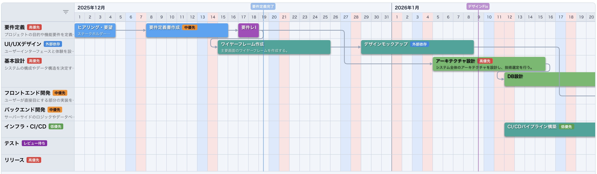
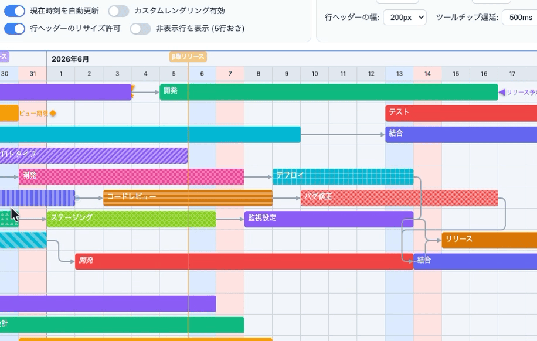
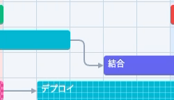
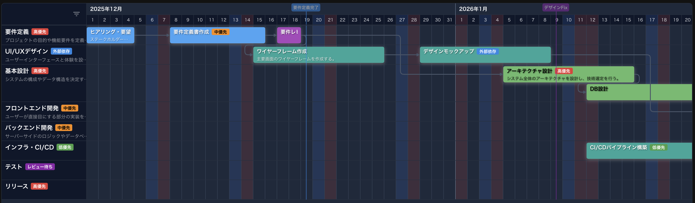
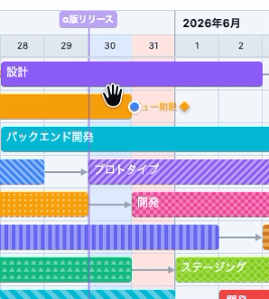
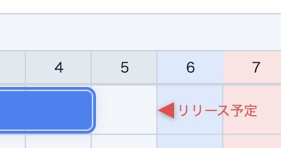
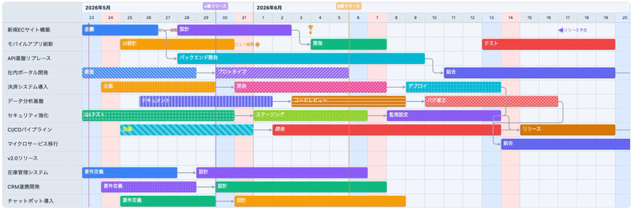

## はじめに

プロジェクト管理ツールを自作しようとしたとき、こんな経験はありませんか？

- 既存のガントチャートライブラリが **特定のフレームワーク（React / Vue / Angular）に依存** していて、技術選定に制約が出る
- 高機能な商用ライブラリは **ライセンス料が高く**、個人や小規模チームでは導入しにくい
- 無料の軽量ライブラリは **機能が不足** していて、実用レベルのUIが作れない

こうした課題を解決するために、**フレームワーク非依存・高機能・MIT ライセンス** のガントチャート Web Components ライブラリ「**moguchart-core**」を開発しました。

https://github.com/hiro-murakami/moguchart-core

デモサイトも公開していますので、実際に動く様子をぜひお試しください！
https://moguchart-core.vercel.app

## moguchart-core とは

`@mogura/moguchart-core` は、[Lit](https://lit.dev/) をベースに構築された **Web Components 製のガントチャートコンポーネント** です。

Custom Elements（`<gantt-chart>`）として動作するため、**Vue、React、Angular、Svelte、あるいはバニラ HTML** — どの環境でもそのまま使えます。

### 主な特徴

| カテゴリ                   | 内容                                                                               |
| :------------------------- | :--------------------------------------------------------------------------------- |
| **フレームワーク非依存**   | Web Components (Custom Elements) として実装。どの環境でも動作                      |
| **仮想スクロール**         | 大量のタスク・行でもスムーズなパフォーマンス                                       |
| **豊富なインタラクション** | D&D でのタスク移動（行間移動対応）、リサイズ、行の並び替え、複数選択＆一括ドラッグ |
| **依存関係の可視化**       | タスク間の依存を矢印付きの曲線（S字カーブ / 直角折れ線）で描画                     |
| **柔軟な表示モード**       | 日 / 週 / 月 / 時間単位の切り替え、ズームレベル調整                                |
| **テーマ対応**             | ライト / ダーク / システム連動 + カスタムカラーテーマ                              |
| **高度なカスタマイズ**     | バー、行ヘッダー、ツールチップ、カレンダーセルなどの描画を関数でオーバーライド可能 |
| **日本語対応**             | ロケール機能内蔵（日本語・英語）、祝日判定ロジックのカスタマイズ対応               |
| **ライセンス**             | MIT                                                                                |

## 既存ライブラリとの違い

JavaScript のガントチャートライブラリは多数存在しますが、大きく2つのカテゴリに分かれます。

### 商用エンタープライズ系（Bryntum, DHTMLX, Syncfusion など）

✅ 非常に高機能・サポート充実
❌ 有料ライセンス（年間数万〜数十万円）

### 無料 OSS 系（Frappe Gantt など）

✅ MIT ライセンスで無料
❌ 機能が限定的（D&D、依存関係表示、仮想スクロールなどが不足）

### moguchart-core の立ち位置

moguchart-core は **「商用ライブラリに迫る機能性を、MIT ライセンスで」** を目指しています。

```
                    機能の充実度
                        ↑
     Bryntum / DHTMLX   |   moguchart-core ← ここ
                        |
    ────────────────────┼──────────────────→ コスト
                        |
          Frappe Gantt  |
                        |
```

特に、以下の点で差別化しています：

- **Web Components ネイティブ** — React/Vue ラッパーではなく、Custom Elements そのもの
- **仮想スクロール** — 数百〜数千行でも軽快
- **日本語ファースト** — ロケール、祝日判定（`@holiday-jp/holiday_jp`）を標準搭載

## インストール

```bash
npm install @mogura/moguchart-core
# または
pnpm add @mogura/moguchart-core
```

## クイックスタート（Vue.js）

```html
<script setup lang="ts">
  import { ref } from 'vue'
  import '@mogura/moguchart-core'
  import type { GanttRow, GanttChartOption } from '@mogura/moguchart-core'

  const rows = ref<GanttRow[]>([
    {
      id: 'row-1',
      name: '開発チームA',
      tasks: [
        {
          id: 't-1',
          name: 'API設計',
          start: new Date('2025-06-01'),
          end: new Date('2025-06-10'),
          style: 'background-color: #60a5fa',
        },
        {
          id: 't-2',
          name: '実装',
          start: new Date('2025-06-10'),
          end: new Date('2025-06-25'),
          style: 'background-color: #34d399',
          dependencies: ['t-1'], // t-1 に依存
        },
      ],
    },
    {
      id: 'row-2',
      name: 'デザインチーム',
      tasks: [
        {
          id: 't-3',
          name: 'UIデザイン',
          start: new Date('2025-06-05'),
          end: new Date('2025-06-15'),
          style: 'background-color: #f472b6',
        },
      ],
    },
  ])

  const option = ref<GanttChartOption>({
    calendar: {
      start: new Date('2025-06-01'),
      end: new Date('2025-07-31'),
      pxPerDay: 30,
      showCurrentTime: true,
    },
    theme: 'system',
  })
</script>

<template>
  <div style="height: 400px;">
    <gantt-chart :rows="rows" :option="option" />
  </div>
</template>
```

## クイックスタート（React）

React では Web Components の特性上、`ref` 経由でプロパティを設定します。

```tsx
import { useEffect, useRef } from 'react'
import '@mogura/moguchart-core'
import type { GanttRow, GanttChartOption } from '@mogura/moguchart-core'

export default function GanttDemo() {
  const chartRef = useRef<any>(null)

  const rows: GanttRow[] = [
    {
      id: 'row-1',
      name: '開発チームA',
      tasks: [
        {
          id: 't-1',
          name: 'API設計',
          start: new Date('2025-06-01'),
          end: new Date('2025-06-10'),
          style: 'background-color: #60a5fa',
        },
      ],
    },
  ]

  const option: GanttChartOption = {
    calendar: {
      start: new Date('2025-06-01'),
      end: new Date('2025-07-31'),
      pxPerDay: 30,
      showCurrentTime: true,
    },
    theme: 'system',
  }

  useEffect(() => {
    const chart = chartRef.current
    if (!chart) return
    chart.rows = rows
    chart.option = option
  }, [])

  return (
    <div style={{ height: '400px' }}>
      <gantt-chart ref={chartRef} />
    </div>
  )
}
```

## 機能ハイライト

### 🎯 タスクのドラッグ＆ドロップ

タスクバーをドラッグして日程変更。行をまたいだ移動にも対応しています。
`Ctrl`（Mac: `Cmd`）+ クリックで複数選択し、一括移動も可能です。（横方向のみ）

```javascript
chart.addEventListener('task-update', (e) => {
  const { id, start, end, targetRowId, mode } = e.detail
  console.log(`タスク ${id} を ${start} 〜 ${end} に移動`)
})
```



### 📐 依存関係線

タスクの `dependencies` に依存先のIDを指定するだけで、矢印付きの接続線が描画されます。

```javascript
const task = {
  id: 't-2',
  name: '実装',
  start: new Date('2025-06-10'),
  end: new Date('2025-06-25'),
  dependencies: ['t-1'], // t-1 の完了後に開始
}
```

接続線のスタイルは `curve`（ベジェ曲線）と `orthogonal`（直角折れ線・角丸）から選択できます。



### 🎨 テーマ＆カスタムカラー

```javascript
const option = {
  theme: 'dark', // 'light' | 'dark' | 'system'
  customTheme: {
    bg: '#1a1a2e',
    currentTimeLine: '#ff6b6b',
    saturday: '#1e3a5f',
  },
}
```

`ThemeColorPalette` では **30 以上のカラートークン** をオーバーライドでき、ブランドカラーに合わせた細かなカスタマイズが可能です。



### 🏁 マイルストーン

チャート上に縦線＋名前バッジでマイルストーンを表示できます。

```javascript
option.calendar.milestones = [
  {
    id: 'ms-1',
    name: 'α版リリース',
    start: new Date('2025-07-01'),
    color: '#8b5cf6',
  },
]
```



### 📍 マーカー

各行のタイムライン上に三角形アイコンとラベルで目印を表示。レビュー期限や重要な日付のマークに便利です。

```javascript
const row = {
  id: 'row-1',
  name: 'タスクA',
  tasks: [/* ... */],
  markers: [
    {
      id: 'marker-1',
      name: 'レビュー期限',
      date: new Date('2025-06-15'),
      type: 'triangle-down',
      color: '#ef4444',
    },
  ],
}
```



### 🖌️ タスクバーの塗りつぶしパターン

**13 種類** のパターン（ストライプ、ドット、チェッカーボードなど）をタスクバーに適用可能。ステータスの視覚的な区別に活用できます。

```javascript
import { PATTERN_DIAGONAL_STRIPE } from '@mogura/moguchart-core'

const task = {
  id: 't-1',
  name: '作業中',
  start: new Date('2025-06-01'),
  end: new Date('2025-06-05'),
  style: 'background-color: #60a5fa',
  pattern: PATTERN_DIAGONAL_STRIPE,
}
```

### 📅 表示モードの切り替え

| モード       | 設定                              | 用途                               |
| :----------- | :-------------------------------- | :--------------------------------- |
| **日単位**   | `pxPerDay: 48`                    | 通常のプロジェクト管理             |
| **週単位**   | `showWeeks: true`, `pxPerDay: 12` | 中長期の俯瞰                       |
| **月単位**   | `pxPerMonth: 120`                 | 年単位のロードマップ               |
| **時間単位** | `pxPerDay: 960`, `showTime: true` | シフト管理・細かなスケジューリング |



### 🖋️ カスタムレンダリング

タスクバー・行ヘッダー・ツールチップ・カレンダーセル・背景セルの描画を関数でオーバーライドでき、HTML（Lit の `TemplateResult`）を自由に返せます。

```javascript
const option = {
  customRendering: {
    barContent: (task) => `<strong>${task.name}</strong>`,
    rowHeaderContent: (row) => `<div>${row.name}<br/><small>${row.id}</small></div>`,
    tooltip: (task) => `${task.name}: ${task.start.toLocaleDateString()} 〜`,
  },
}
```

### 🌐 ロケール＆祝日

日本語/英語のビルトインロケールを切り替えるだけでなく、カスタムロケールも定義できます。

```javascript
import { enLocale } from '@mogura/moguchart-core'
import * as holiday_jp from '@holiday-jp/holiday_jp'

const option = {
  locale: enLocale,
  calendar: {
    isHoliday: holiday_jp.isHoliday, // 日本の祝日をハイライト
  },
}
```

### 📤 画像/PDF エクスポート

チャートを PNG 画像や PDF として書き出すメソッドを内蔵しています（`html2canvas-pro` / `jspdf` を利用）。

```javascript
const chart = document.querySelector('gantt-chart')
await chart.exportImage('png', { download: true, filename: 'gantt' })
await chart.exportImage('pdf', { download: true, filename: 'gantt' })
```

## アーキテクチャ

```
@mogura/moguchart-core
├── components/
│   ├── gantt-chart.ts          # メインコンポーネント (Custom Element)
│   ├── gantt-calendar.ts       # カレンダーヘッダー
│   ├── gantt-bar.ts            # タスクバー
│   ├── gantt-row.ts            # 行コンポーネント
│   ├── gantt-row-background.ts # 行背景（土日祝ハイライト）
│   ├── gantt-chart-dependency-path.ts  # 依存関係線の描画
│   ├── gantt-chart-export.ts   # PNG/PDF エクスポート
│   └── gantt-chart-styles.ts   # CSS スタイル定義
└── core/
    ├── types.ts    # 全型定義（650行超の充実したTypeScript型）
    ├── theme.ts    # テーマカラーパレット
    ├── patterns.ts # バーパターン（SVG背景生成）
    ├── i18n.ts     # ロケール定義
    ├── utils.ts    # ユーティリティ関数
    └── constants.ts
```

Lit の Reactive Properties を活用し、`rows` や `option` が変更されると自動的に再レンダリングされます。仮想スクロールにより、画面外の要素はDOMに描画されないため、大量データでも軽快に動作します。

## 📱 moguchart-core を使ったアプリケーション「MoguChart」

moguchart-core は汎用ライブラリとして開発していますが、実は **このライブラリを活用した本格的なプロジェクト管理アプリケーション「MoguChart」** も並行して開発しています。

MoguChart は Vue.js + Vuetify をベースに、moguchart-core のガントチャートコンポーネントを中心に据えた Web アプリケーションです。タスク管理・チーム共有・リアルタイム同期など、実務で使える機能を備えています。

👉 **MoguChart の詳細は別記事で紹介しています！**

<!-- TODO: 記事公開後にURLを差し替えてください -->

https://qiita.com/hiro-murakami/items/xxxxxxx

ライブラリ単体の機能に興味を持っていただけた方は、ぜひアプリケーション側の記事もご覧ください 🙌

## おわりに

moguchart-core は、**「フレームワークに縛られず、高機能なガントチャートを手軽に組み込みたい」** という自分自身のニーズから生まれたライブラリです。

まだ公開開始したばかりですが、コア機能はかなり充実しています。フィードバックや Issue、Pull Request を歓迎しています！

https://github.com/hiro-murakami/moguchart-core

何か質問や要望があれば、お気軽にどうぞ 🙌

## 参考リンク

- [デモサイト](https://moguchart-core.vercel.app)
- [GitHub リポジトリ](https://github.com/hiro-murakami/moguchart-core)
- [API リファレンス（日本語）](https://github.com/hiro-murakami/moguchart-core/blob/main/doc/API.md)
- [Lit 公式サイト](https://lit.dev/)
- [Web Components - MDN](https://developer.mozilla.org/ja/docs/Web/API/Web_components)
