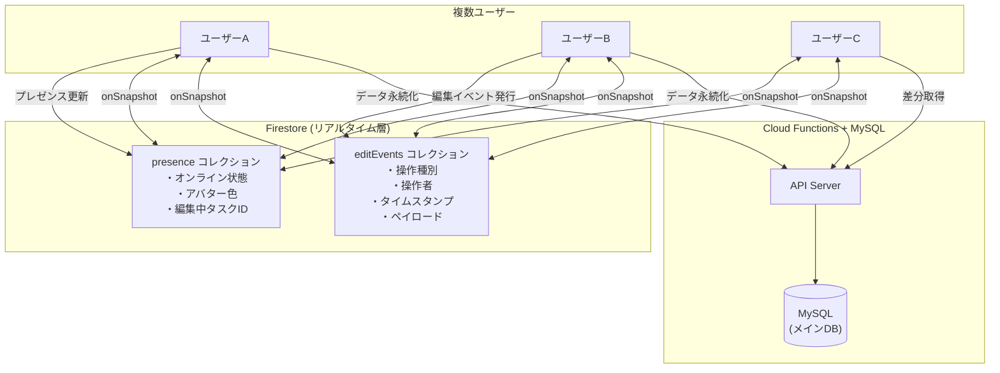
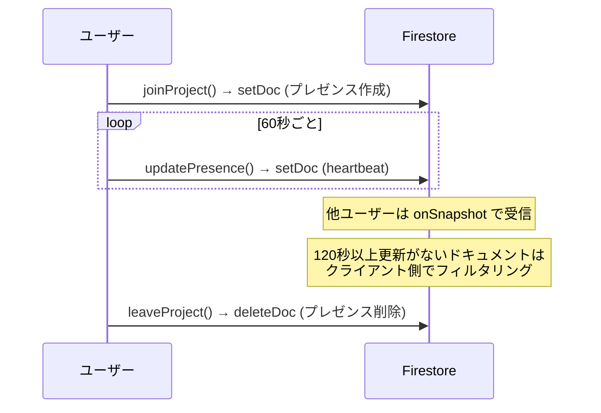
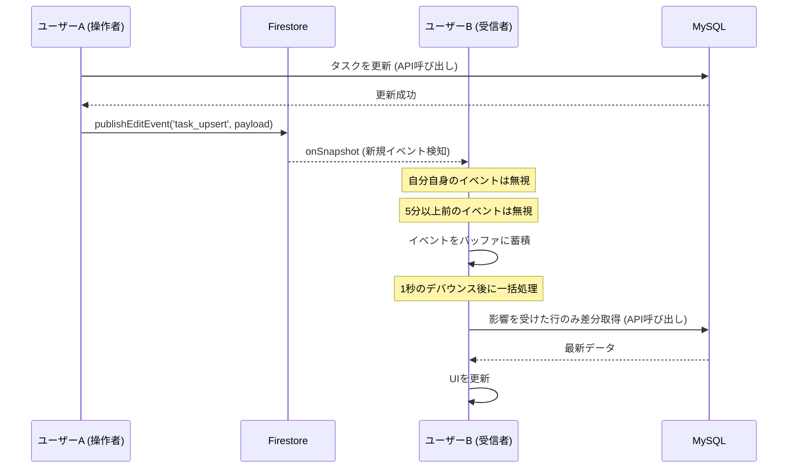

## はじめに

「チームでガントチャートを同時に編集したい。でも、誰が何を変更したのかわからなくて怖い…」

プロジェクト管理ツールにおいて、**リアルタイム共同編集**はもはや必須機能です。Google スプレッドシートや Figma のように、誰がオンラインで何を編集しているかが可視化され、変更が即座に反映される体験は、チームの生産性を大きく向上させます。

本記事では、個人開発しているガントチャートWebアプリ **「[MoguChart](https://moguchart.jp)」** にリアルタイム共同編集機能を実装した際の**設計思想・アーキテクチャ・実装の詳細**を解説します。

:::note info
MoguChart の全体アーキテクチャについては、別記事「[個人開発で本格ガントチャートWebアプリ「MoguChart」を作った話](https://qiita.com/hiroyuki_m/items/d1d2b644890e49b796e7)」をご覧ください。

また、アプリケーションのソースコードは GitHub リポジトリ [hiro-murakami/moguchart-app](https://github.com/hiro-murakami/moguchart-app) で公開しています。
:::

## リアルタイム共同編集の全体像

MoguChart の共同編集機能は、大きく**3つの柱**で構成されています。



| 機能 | 役割 | データストア |
|---|---|---|
| **① プレゼンス** | 「誰がオンラインか」「何を編集中か」を表示 | Firestore |
| **② 編集イベント同期** | 他ユーザーの変更をリアルタイムに反映 | Firestore → MySQL |
| **③ アクティビティログ** | 変更履歴をタイムラインで可視化 | クライアントメモリ |

### なぜ Firestore と MySQL のハイブリッド構成なのか

MoguChart のメインデータ（プロジェクト・行・タスク）は **MySQL** に保存しています。ガントチャートのデータはリレーショナルな構造を持つため、RDB が適しています。

一方で、プレゼンスや編集イベントのような**揮発性の高いリアルタイムデータ**には Firestore の `onSnapshot` が最適です。

```
MySQL (Prisma ORM)   → 永続データ（タスク、行、プロジェクト、コメント）
Firestore            → 揮発データ（プレゼンス、編集イベント）
```

この**ハイブリッド構成**により、「データの信頼性」と「リアルタイム性」を両立しています。

## ① プレゼンス管理

### Firestore データモデル

プレゼンス情報は、プロジェクトごとのサブコレクションとして管理しています。

```
/projects/{projectId}/presence/{userEmail}
```

各ドキュメントには以下のデータを格納します：

```typescript
/** プレゼンス情報（現在プロジェクトを開いているユーザー） */
interface PresenceData {
  /** 表示名 */
  displayName: string
  /** 最終アクティブ日時（ISO 8601形式） */
  lastActiveAt: string
  /** アバター表示色 */
  color: string
  /** アバター画像URL（Google認証のプロフィール画像等） */
  avatarUrl?: string
  /** 現在編集中のタスクID一覧 */
  editingTaskIds?: string[]
}
```

### ドキュメントIDにメールアドレスを使う設計

ユーザーの識別子（ドキュメントID）に**メールアドレス**を使用しています。これにより：

- **同一ユーザーが複数タブを開いても、プレゼンスは1つ**に統合される
- ドキュメント作成時に `setDoc`（upsert）を使用でき、重複が発生しない
- Firebase Auth のメールアドレスとの紐付けがシンプル

### アバター色の決定的生成

ユーザーのアバター色は、メールアドレスから**ハッシュ関数**で決定的に生成しています。同じユーザーは常に同じ色で表示されます。

```typescript
const AVATAR_COLORS = [
  '#ef5350', '#ab47bc', '#5c6bc0', '#42a5f5', '#26a69a',
  '#66bb6a', '#ffa726', '#8d6e63', '#ec407a', '#7e57c2',
]

const getAvatarColor = (email: string): string => {
  let hash = 0
  for (let i = 0; i < email.length; i++) {
    hash = (hash << 5) - hash + email.charCodeAt(i)
    hash |= 0
  }
  return AVATAR_COLORS[Math.abs(hash) % AVATAR_COLORS.length]!
}
```

ランダム生成ではなくハッシュベースにすることで、**ページリロードやセッション跨ぎでも色がブレない**安定した体験を提供しています。

### ハートビートによるタイムアウト検出

プレゼンスの生存管理は、**ハートビート方式**を採用しています。

```typescript
/** ハートビート間隔: 60秒ごとに lastActiveAt を更新 */
const HEARTBEAT_INTERVAL = 60_000

/** タイムアウト: 120秒以上更新がないユーザーは非アクティブ */
const PRESENCE_TIMEOUT = 120_000
```



**なぜ Firebase Realtime Database の `onDisconnect` を使わないのか？**

Firebase Realtime Database の `onDisconnect` はサーバー側でクリーンアップを自動実行してくれます。しかし今回は Firestore を採用しているため、クライアント側のハートビート方式でタイムアウトを検出しています。

`beforeunload` イベントでのクリーンアップも併用していますが、ブラウザクラッシュやネットワーク切断時には発火しないため、ハートビートによるタイムアウトが**フォールバック**として機能します。

```typescript
// ページ離脱時のクリーンアップ
const handleBeforeUnload = () => {
  if (currentProjectId && currentUserEmail) {
    const presenceRef = doc(db, 'projects', currentProjectId, 'presence', currentUserEmail)
    deleteDoc(presenceRef).catch(() => {
      // ページ離脱中なのでエラーは無視
    })
  }
}
```

### 編集中タスクのハイライト

プレゼンスには**現在編集中のタスクID**も含めています。これにより、他のユーザーが編集中のタスクバーをリアルタイムでハイライト表示できます。

```typescript
// 他ユーザーが編集中のタスクにアウトラインとパルスアニメーションを適用
const applyRemoteEditingHighlight = (
  task: GanttTask,
  editingMap: Map<string, { color: string; displayName: string }>,
): GanttTask => {
  const editing = editingMap.get(String(task.id))
  if (!editing) return task

  const highlightStyle =
    `outline: 2.5px solid ${editing.color};` +
    `outline-offset: 2px;` +
    `box-shadow: 0 0 8px 2px ${editing.color}66;` +
    `animation: collab-pulse 2s ease-in-out infinite;`

  return { ...task, style: highlightStyle }
}
```

ハイライトはユーザーのアバター色と連動しているため、**誰が編集しているか一目でわかる**UIになっています。

## ② 編集イベント同期

### イベント駆動型アーキテクチャ

MoguChart のリアルタイム同期は、**イベント駆動型**の設計を採用しています。ユーザーの操作をイベントとして Firestore に発行し、他のユーザーがそれを `onSnapshot` で受信して差分更新を行います。

```
/projects/{projectId}/editEvents/{eventId}
```

```typescript
/** 編集イベントの種類 */
type EditEventType =
  | 'task_upsert'     // タスクの追加・更新
  | 'task_delete'     // タスクの削除
  | 'row_upsert'      // 行の追加・更新
  | 'row_delete'      // 行の削除
  | 'row_reorder'     // 行の並び替え
  | 'full_reload'     // 全データの再読み込み
  | 'comment_update'  // コメントの更新

/** 編集イベントのドキュメント構造 */
interface EditEvent {
  type: EditEventType
  userEmail: string
  timestamp: string           // ISO 8601形式
  payload?: Record<string, any>  // 操作の詳細データ
}
```

### イベントのライフサイクル



### 重要な設計判断: データは MySQL、通知は Firestore

編集イベントには**操作の内容（ペイロード）**を含めていますが、**データそのものは含めていません**。イベントは「何が変わったか」の通知であり、実際のデータは MySQL から取得します。

```typescript
// タスク更新時の編集イベント発行例
publishEditEvent('task_upsert', {
  taskId: task.id,
  rowIds: [task.rowId],       // 影響を受ける行のID
  targetName: task.name,      // アクティビティログ用
  isNew: false,               // 新規か更新か
})
```

この設計の利点：

1. **データの一貫性** — Single Source of Truth は常に MySQL
2. **イベントの軽量性** — Firestore に書き込むデータが最小限
3. **競合の回避** — 複数ユーザーが同時編集しても、最新のDBデータを取得するだけ

### デバウンス付き差分更新

他ユーザーからのイベントは、**1秒のデバウンス**をかけてバッチ処理します。連続的な操作（タスクの連続更新など）で API を過剰に呼び出さないための工夫です。

```typescript
// イベントをバッファに蓄積
let pendingEditEvents: { type: string; payload?: Record<string, any> }[] = []

// 1秒のデバウンス後にバッチ処理
const flushRemoteEdits = debounce(async () => {
  const events = pendingEditEvents
  pendingEditEvents = []

  // 構造変更を伴う操作は全行差し替え
  const needsFullReload = events.some((e) =>
    ['full_reload', 'row_delete', 'row_upsert', 'row_reorder'].includes(e.type),
  )

  if (needsFullReload) {
    await applyDelta()  // 全行取得
    return
  }

  // タスク単位の操作は影響行のみ差分取得
  const affectedRowIds = new Set<string>()
  for (const e of events) {
    if (e.payload?.rowIds) {
      for (const id of e.payload.rowIds) {
        affectedRowIds.add(String(id))
      }
    }
  }

  if (affectedRowIds.size > 0) {
    await applyDelta([...affectedRowIds])  // 影響行のみ取得
  } else {
    await applyDelta()  // フォールバック: 全行取得
  }
}, 1000)

// イベント受信時
onEditEvent((event) => {
  pendingEditEvents.push({ type: event.type, payload: event.payload })
  flushRemoteEdits()
})
```

### 差分更新の仕組み (`applyDelta`)

`applyDelta` 関数は、影響を受けた行のみをサーバーから取得し、ローカルの行データを最小限に差し替えます。

```typescript
const applyDelta = async (affectedRowIds?: string[]) => {
  // 影響行が指定されている場合は行単位のAPIを呼び出し
  const data = affectedRowIds && affectedRowIds.length > 0
    ? await selectGanttRows({ projectId, rowIds: affectedRowIds.map(Number) })
    : await selectGanttChart(projectId)

  if (affectedRowIds && affectedRowIds.length > 0) {
    // 影響を受ける行だけ差し替え（他の行はそのまま保持）
    const freshMap = new Map(freshRows.map((r) => [String(r.id), r]))
    rows.value = rows.value.map((row) => {
      if (affectedRowIds.includes(String(row.id))) {
        return freshMap.get(String(row.id)) || row
      }
      return row  // 変更のない行はそのまま
    })
  } else {
    // 構造的な変更 → 全行差し替え
    rows.value = freshRows
  }
}
```

**行単位の差分取得API (`selectGanttRows`)** を用意することで、タスクの移動や更新時に全データを再取得せずに済みます。100行以上のプロジェクトでも、変更のあった1〜2行だけを取得するため、**ネットワーク負荷とレンダリングコストを最小化**しています。

### 自分自身のイベントは無視

Firestore の `onSnapshot` は自分が書き込んだドキュメントも通知します。そのため、**自分自身のイベントを明示的にフィルタリング**しています。

```typescript
// 自分自身のイベントは無視
if (event.userEmail === currentUserEmail) return

// 古すぎるイベントは無視（5分以上前）
const eventTime = new Date(event.timestamp).getTime()
if (now - eventTime > EVENT_TIME_WINDOW) return

// 既に処理済みのイベントは無視（タイムスタンプの単調増加チェック）
if (lastProcessedTimestamp && event.timestamp <= lastProcessedTimestamp) return
```

### editEvents のクリーンアップ

編集イベントは蓄積し続けると Firestore の読み取りコストが増大するため、**自動クリーンアップ**を実装しています。

```typescript
/** 5分以上前のイベントをバッチ削除 */
const cleanupOldEditEvents = async () => {
  // 呼び出し頻度を60秒に1回に制限
  if (now - lastCleanupTime < CLEANUP_MIN_INTERVAL) return

  const cutoff = new Date(now - EVENT_TIME_WINDOW).toISOString()
  const q = query(eventsCol, where('timestamp', '<', cutoff))
  const snapshot = await getDocs(q)

  // Firestore の writeBatch は最大500件まで
  for (let i = 0; i < docs.length; i += 500) {
    const batch = writeBatch(db)
    docs.slice(i, i + 500).forEach((d) => batch.delete(d.ref))
    await batch.commit()
  }
}
```

クリーンアップは以下のタイミングで実行されます：
- プロジェクトへの参加時（`joinProject`）
- 編集イベント発行後（非同期・非ブロッキング）

## ③ アクティビティログ

### 変更履歴の可視化

受信した編集イベントは、**アクティビティログ**として UI の右下にフローティングパネルで表示されます。

```typescript
interface ActivityLogEntry {
  id: string
  displayName: string      // 操作ユーザーの表示名
  userEmail: string
  avatarUrl?: string       // Google プロフィール画像
  color: string            // アバター色
  description: string      // 「タスク「設計」を更新」のような日本語説明
  type: EditEventType
  timestamp: string
  taskId?: string          // クリックでタスクにジャンプ
  rowId?: string
  targetName?: string
}
```

### 操作の日本語化

イベント種別からユーザーフレンドリーな説明文を自動生成しています：

```typescript
const getEventDescription = (type: EditEventType, targetName?: string, isNew?: boolean): string => {
  switch (type) {
    case 'task_upsert':
      return `タスク「${targetName}」を${isNew ? '追加' : '更新'}`
    case 'task_delete':
      return `タスク「${targetName}」を削除`
    case 'row_upsert':
      return `行「${targetName}」を${isNew ? '追加' : '更新'}`
    case 'row_delete':
      return `行「${targetName}」を削除`
    case 'row_reorder':
      return '行の並び順を変更'
    case 'comment_update':
      return `「${targetName}」のコメントを更新`
    case 'full_reload':
      return 'データを更新'
  }
}
```

### アクティビティログのUI

ログパネルは **glassmorphism** スタイルで、画面右下にフローティング表示されます。

```css
.activity-log-container {
  position: fixed;
  bottom: 16px;
  right: 16px;
  width: 340px;
  border-radius: 12px;
  background: rgba(250, 250, 250, 0.95);
  backdrop-filter: blur(16px);
  box-shadow: 0 4px 24px rgba(0, 0, 0, 0.1);
}
```

- **未読バッジ**: パネルを閉じている間に受信した変更の件数を表示
- **タスクリンク**: ログ内のタスク名をクリックすると、チャート上の該当タスクに自動スクロール＆選択
- **ダブルクリック**: タスクの詳細ダイアログを直接開く
- **アニメーション**: 新しいログの追加やパネルの開閉にスムーズなトランジションを適用

## Firestore セキュリティルール

リアルタイム機能のセキュリティルールは**必要最小限**の設計です。

```javascript
rules_version = '2';

service cloud.firestore {
  match /databases/{database}/documents {

    // プレゼンス: 認証済みユーザーは読み取り可、自分のドキュメントのみ書き込み可
    match /projects/{projectId}/presence/{userId} {
      allow read: if request.auth != null;
      allow write: if request.auth != null
        && (request.auth.token.email == userId
            || request.auth.uid == userId);
    }

    // 編集イベント: 認証済みなら作成・読み取り可、更新不可（append-only）
    match /projects/{projectId}/editEvents/{eventId} {
      allow read: if request.auth != null;
      allow create: if request.auth != null;
      allow delete: if request.auth != null;
      allow update: if false;  // イミュータブル
    }
  }
}
```

### ポイント

| ルール | 理由 |
|---|---|
| プレゼンスの書き込みは本人のみ | 他ユーザーのプレゼンスを偽装できないようにする |
| editEvents は `update: false` | イベントはイミュータブル（追記専用）。改ざん防止 |
| 匿名ユーザーは `uid` で認証 | ゲストログイン（Firebase Anonymous Auth）にも対応 |

## Graceful Degradation

Firestore に接続できない環境（ファイアウォール制限など）でも、**アプリケーションの基本機能は正常に動作**するよう設計しています。

```typescript
/** Firestore が利用可能かどうか */
let firestoreAvailable = true

const disableFirestore = (context: string, err: unknown) => {
  if (firestoreAvailable) {
    console.warn(
      `[Collaboration] Firestore unavailable (${context}). ` +
      `Realtime collaboration disabled.`
    )
    firestoreAvailable = false
  }
}

// 以降の全操作で firestoreAvailable をチェック
const updatePresence = async () => {
  if (!firestoreAvailable) return  // Firestore 無効時はスキップ
  // ...
}
```

一度エラーが発生すると `firestoreAvailable` が `false` になり、以降はすべてのリアルタイム操作がスキップされます。ユーザーには影響を与えず、**コラボレーション機能だけが静かに無効化**されます。

## Undo/Redo との統合

共同編集環境での Undo/Redo は注意が必要です。MoguChart では、**コマンドパターン**で各操作の逆操作を管理しています。

```typescript
interface UndoRedoAction {
  description: string
  undo: () => Promise<void>    // 元に戻す操作
  redo: () => Promise<void>    // やり直す操作
}
```

Undo/Redo 実行後は、`full_reload` イベントを発行して他ユーザーのUIも更新されるようにしています。

```typescript
const undo = async () => {
  await _undo()
  publishEditEvent('full_reload')  // 他ユーザーに通知
}

const redo = async () => {
  await _redo()
  publishEditEvent('full_reload')  // 他ユーザーに通知
}
```

:::note warn
現在の実装では「自分の操作の Undo」のみが可能です。他ユーザーの操作を元に戻す機能は意図的に実装していません。共同編集環境では、他人の変更を勝手に元に戻すことはトラブルの原因になるためです。
:::

## Vue Composable による責務分離

リアルタイム共同編集のロジックは、Vue の **Composable パターン**で責務を分離しています。

```
composables/
  useCollaboration.ts    → プレゼンス・イベント同期の低レベル管理
  useUndoRedo.ts         → コマンドパターンによるUndo/Redo管理

views/composables/
  useGanttChartView.ts   → ガントチャートのビジネスロジック
                            (上記composableを統合し、UI操作とイベント発行を紐付け)

components/
  CollaborationActivityLog.vue  → アクティビティログUI
```

`useCollaboration` は**Firebase SDK との通信**に専念し、ビジネスロジック（「タスク更新後にイベントを発行する」など）は `useGanttChartView` で処理します。

```typescript
// useGanttChartView.ts 内での使用例
const { activeUsers, editLogs, joinProject, leaveProject,
        publishEditEvent, onEditEvent, updateEditingTasks } =
  useCollaboration()

// タスク保存後にイベントを発行
const saveTask = async (task: EditingTaskData) => {
  await upsertGanttTasks([task])  // MySQL に保存

  publishEditEvent('task_upsert', {
    taskId: task.id,
    rowIds: [task.rowId],
    targetName: task.name,
    isNew: !task.id,
  })
}
```

## パフォーマンス上の工夫

### 1. 行単位の差分取得

全データを再取得するのではなく、`rowIds` を指定して**影響行のみ**を取得する API を用意しています。

### 2. デバウンスによるバッチ処理

連続的なイベント（例: ドラッグ中のリアルタイム更新）を1秒のデバウンスでまとめて処理します。

### 3. クライアント側フィルタリング

Firestore のクエリインデックスの制約を避けるため、`editEvents` コレクション全体を `onSnapshot` でリッスンし、**フィルタリングはクライアント側**で行っています。

```typescript
// コレクション全体をリッスンし、フィルタリングはクライアント側で行う
// （where + orderBy の複合クエリはインデックスが必要なためシンプルに）
eventsUnsubscribe = onSnapshot(eventsCol, (snapshot) => {
  snapshot.docChanges().forEach((change) => {
    if (change.type === 'added') {
      const event = change.doc.data() as EditEvent
      if (event.userEmail === currentUserEmail) return  // 自分は無視
      // 5分以上前のイベントは無視
      if (now - eventTime > EVENT_TIME_WINDOW) return
      // ...
    }
  })
})
```

### 4. editEvents の自動クリーンアップ

古いイベントの蓄積による読み取りコスト増を防ぐため、5分以上前のイベントを定期的にバッチ削除しています。

## まとめ

MoguChart のリアルタイム共同編集は、以下の設計原則に基づいています。

| 原則 | 実装 |
|---|---|
| **Single Source of Truth** | メインデータは MySQL。Firestore は通知チャネル |
| **イベント駆動型** | 操作を編集イベントとして発行し、受信側が差分を自律的に取得 |
| **最小限のデータ転送** | 行単位の差分取得 + デバウンスによるバッチ処理 |
| **Graceful Degradation** | Firestore 障害時もアプリ本体は正常動作 |
| **セキュリティ** | 自分のプレゼンスのみ書き込み可 + イベントはイミュータブル |
| **UXの一貫性** | アバター色はハッシュベースで決定的 + 操作ログは日本語で可読性確保 |

CRDTやOT (Operational Transformation) のような本格的なリアルタイム同期アルゴリズムは採用せず、**イベント通知 + DB差分取得**というシンプルな戦略で十分な共同編集体験を実現できました。ガントチャートのような「同じセルを同時に編集する」ことが稀なユースケースでは、この方式が**実装コスト・メンテナンス性・信頼性のバランス**に優れています。

---

ご質問やフィードバックがありましたら、コメントでお気軽にどうぞ！
